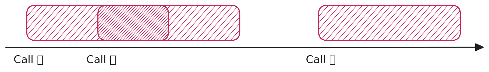
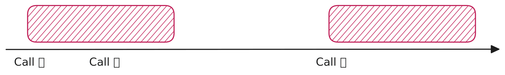

# Lodash

## Debounce



```js
function debounce(fn, wait) {
  let id;
  return function (...args) {
    if (id) {
      clearTimeout(id);
      id = setTimeout(() => {
        id = null;
      }, wait);
    } else {
      fn.call(this, ...args);
      id = setTimeout(() => {
        id = null;
      }, wait);
    }
  };
}
```

## Throttle



```js
function throttle(fn, wait) {
  let id;
  return function (...args) {
    if (!id) {
      fn.call(this, ...args);
      id = setTimeout(() => {
        id = null;
      }, wait);
    }
  };
}
```
