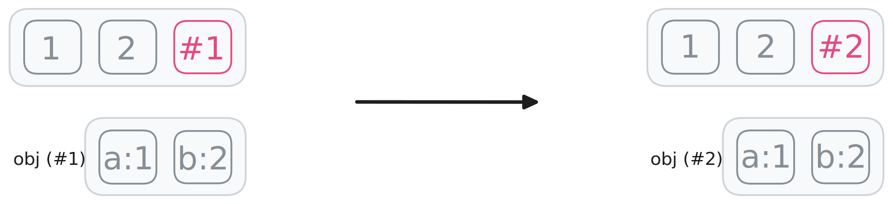

# Lodash

## Debounce


```js
function debounce(fn, wait) {
  let id;
  return function (...args) {
    if (id) {
      clearTimeout(id);
      id = setTimeout(() => {
        id = null;
      }, wait);
    } else {
      fn.call(this, ...args);
      id = setTimeout(() => {
        id = null;
      }, wait);
    }
  };
}
```

## Throttle


```js
function throttle(fn, wait) {
  let id;
  return function (...args) {
    if (!id) {
      fn.call(this, ...args);
      id = setTimeout(() => {
        id = null;
      }, wait);
    }
  };
}
```

## Memoize

```js
function memoize(fn) {
  const cache = new Map();
  return function (...args) {
    const key = JSON.stringify(args);
    if (cache.has(key)) {
      return cache.get(key);
    }
    const value = fn.call(this, ...args);
    cache.set(key, value);
    return value;
  };
}
```

## Curry

```js
function curry(fn) {
  return function curried(...args) {
    if (args.length === fn.length) {
      console.log(this);
      return fn.call(this, ...args);
    }
    return function (...rest) {
      return curried.call(this, ...args, ...rest);
    };
  };
}
```

## Clone Shallow


```js
function cloneShallow(target) {
  const clone = Array.isArray(target) ? [] : {};
  for (let [key, val] of Object.entries(target)) {
    clone[key] = val;
  }
  return clone;
}
```

## Clone Deep



```js
function cloneDeep(target) {
  const clone = Array.isArray(target) ? [] : {};
  for (let [key, val] of Object.entries(target)) {
    if (val instanceof Object) {
      clone[key] = cloneDeep(val);
    } else {
      clone[key] = val;
    }
  }
  return clone;
}
```
