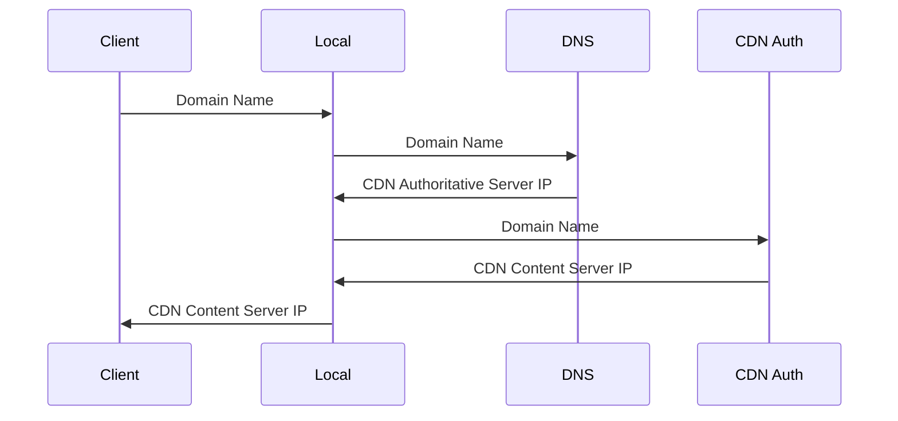
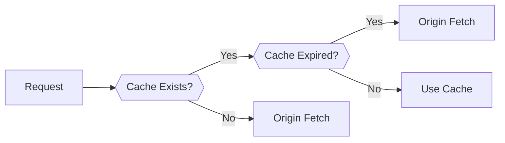

# CDN

## Lookup

## Cluster Selection Strategies

1. **Geographically closest**: select the CDN cluster that is closest to the user's location based on their IP address.
2. **RTT closest**: select the CDN cluster that has the lowest round-trip time to the user's location.

## Caching

If a client requests a video from a cluster that is not storing the video, then the cluster retrieves the video (from a central repository or from another cluster) and stores a copy locally while streaming the video to the client at the same time.

## Servers

| Type                     | Description                          |
| ------------------------ | ------------------------------------ |
| CDN Authoritative Server | Domain Name -> CDN Content Server IP |
| CDN Content Server       | Domain Name -> Content               |
