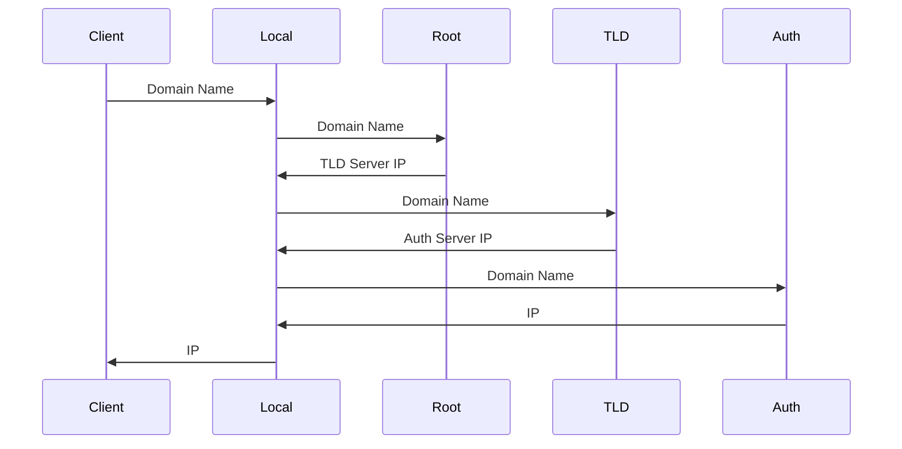
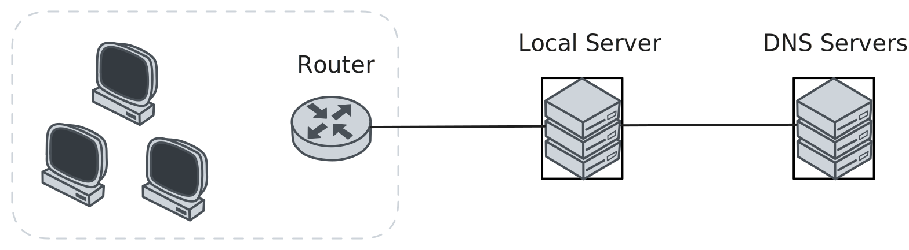

# DNS

[Domain Name System](https://datatracker.ietf.org/doc/html/rfc1035) (DNS), translates hostnames to IP addresses.

## Lookup

## Caching

1. Operating System
2. Browser
3. DNS Servers

## Servers

| Type                          | Description                                |
| ----------------------------- | ------------------------------------------ |
| Local DNS Server              | Proxy Query                                |
| Root DNS Server               | Domain Name -> TLD Server IP               |
| Top-level Domain (TLD) Server | Domain Name -> Authoritative DNS Server IP |
| Authoritative DNS Server      | Domain Name -> IP                          |

## Records

| Type  | Description                           |
| ----- | ------------------------------------- |
| A     | Domain Name -> IPv4                   |
| CNAME | Domain Name Alias -> Domain Name      |
| NS    | Domain Name -> DNS Server Domain Name |
| AAAA  | Domain Name -> IPv6                   |

> [!TIP]
>
> **If TLD returns only the domain, how do Local server kown its IP?**
>
> TLD returns a Glue Record: is a type of DNS record that associates a nameserver's hostname with its IP address

## Hijacking

DNS server cached records are tampered with, resulting in an incorrect IP address being returned.

**types**

1. local server hijacking
2. router hijacking

**Usage**

- block a specific domain name (Great Firewall)
- ISP collects data (redeirect to a particular IP when access an unknown domain)

**Defense**

- changing router passwords
- using VPN
- using Google DNS
