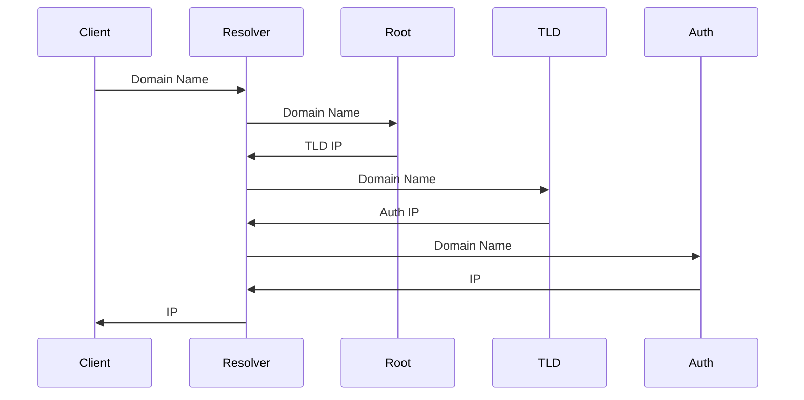

# DNS

Domain Name System

## Lookup

### Cache

1. Operating System
2. Browser
3. DNS Server

### Server

| Type                      | Description                                 |
| ------------------------- | ------------------------------------------- |
| DNS Resolver              | Proxy Query                                 |
| Root Name Server          | Domain Name -> TLD Name Server IP           |
| TLD Name Server           | Domain Name -> Authoritative Name Server IP |
| Authoritative Name Server | Domain Name -> IP                           |

### Message

| Type  | Description                      |
| ----- | -------------------------------- |
| A     | Domain Name -> IPv4              |
| CNAME | Domain Name Alias -> Domain Name |
| AAAA  | Domain Name -> IPv6              |
| PTR   | IP -> Domain Name                |
| MX    | Mail -> IP                       |
