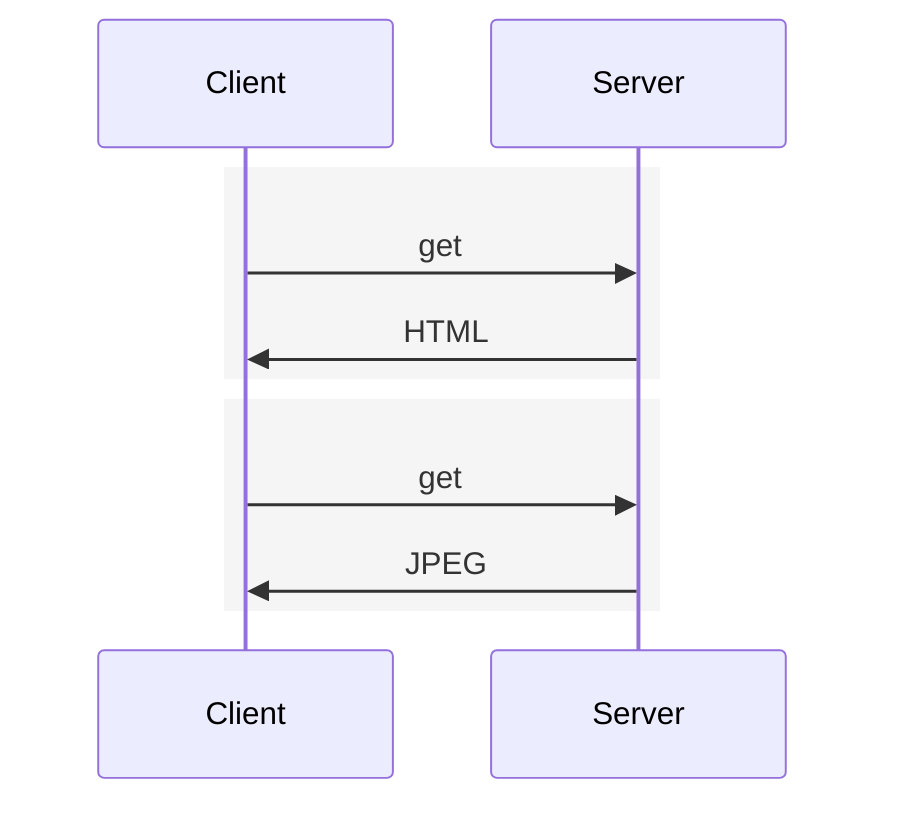
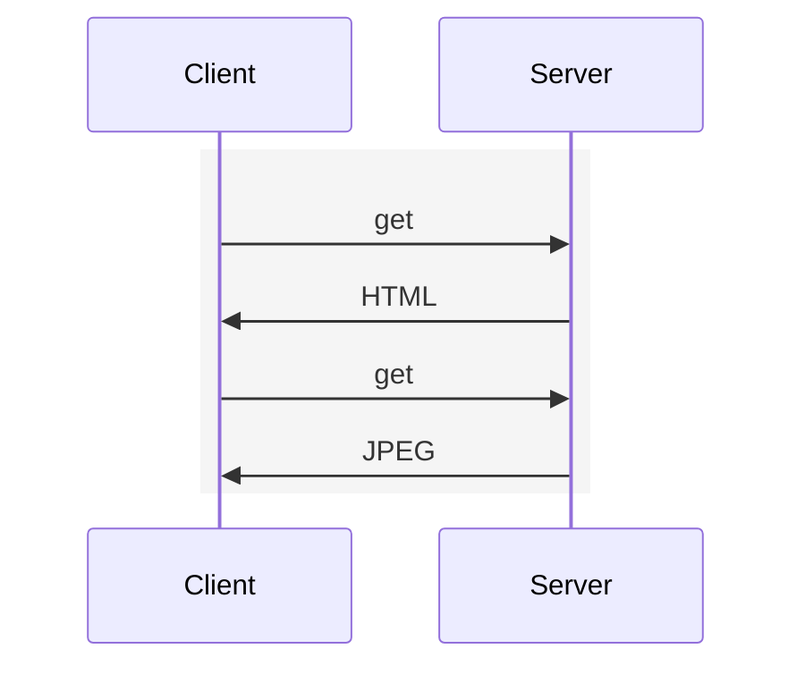

# HTTP

HyperText Transfer Protocol (HTTP), the Web’s application-layer protocol.

> RFC: [HTTP/1.0](https://datatracker.ietf.org/doc/html/rfc1945), [HTTP/1.1](https://datatracker.ietf.org/doc/html/rfc7230), [HTTP/2](https://datatracker.ietf.org/doc/html/rfc7540)

> ![TIP]
>
> **stateless**
>
> server maintains no information about the clients

## Non-Persistent and Persistent Connections

1. non-persistent connections

each request/response pair be sent over a separate TCP connection

delay: 4 RTTs

2. persistent connections

each request/response pair be sent over the same TCP connection

delay: 3 RTTs

## With and Without Pipelining
