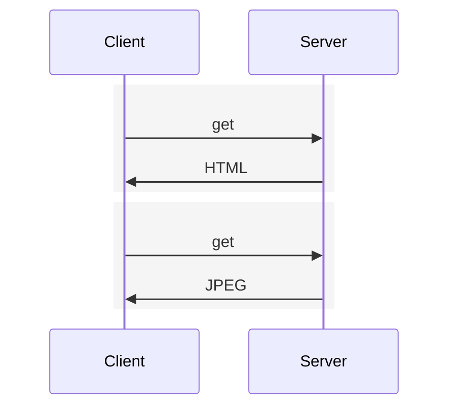
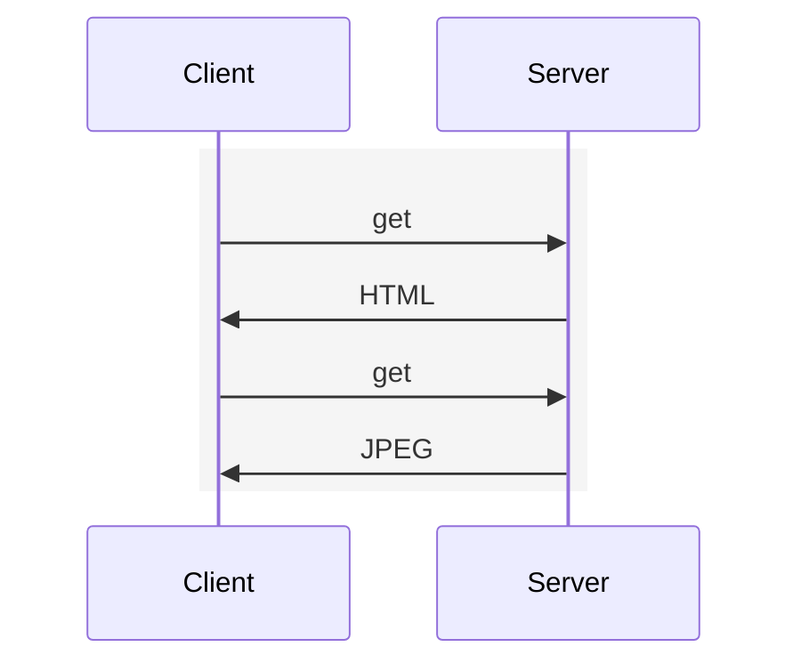

# HTTP

HyperText Transfer Protocol (HTTP), the Web’s application-layer protocol.

> RFC: [HTTP/1.0](https://datatracker.ietf.org/doc/html/rfc1945), [HTTP/1.1](https://datatracker.ietf.org/doc/html/rfc7230), [HTTP/2](https://datatracker.ietf.org/doc/html/rfc7540)

> [!TIP]
>
> **stateless**
>
> server maintains no information about the clients

## Non-Persistent and Persistent Connections

1. **non-persistent connections**

   each request/response pair be sent over a separate TCP connection, delay is 4 RTTs



2. **persistent connections**

   each request/response pair be sent over the same TCP connection, delay is 3 RTTs



## With and Without Pipelining

## Messages


1. HTTP Request Message

   ```txt
   GET /somedir/page.html HTTP/1.1
   Host: www.someschool.edu
   Connection: close
   User-agent: Mozilla/5.0
   Accept-language: fr
   ```

2. HTTP Response Message

   ```txt
   HTTP/1.1 200 OK
   Connection: close
   Date: Tue, 18 Aug 2015 15:44:04 GMT
   Server: Apache/2.2.3 (CentOS)
   Last-Modified: Tue, 18 Aug 2015 15:11:03 GMT
   Content-Length: 6821
   Content-Type: text/html

   (data data data data data ...)
   ```
