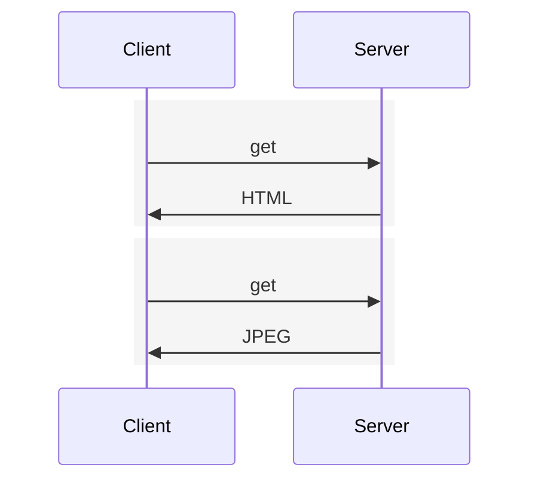
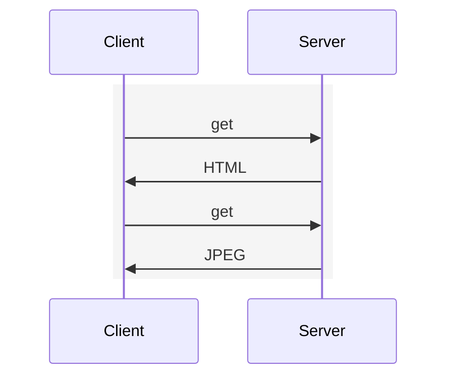
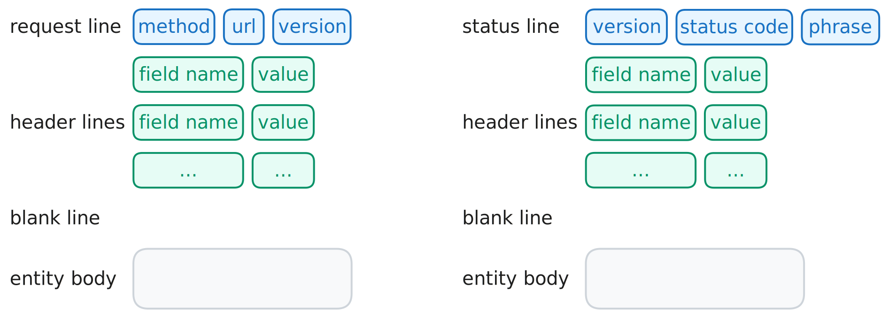
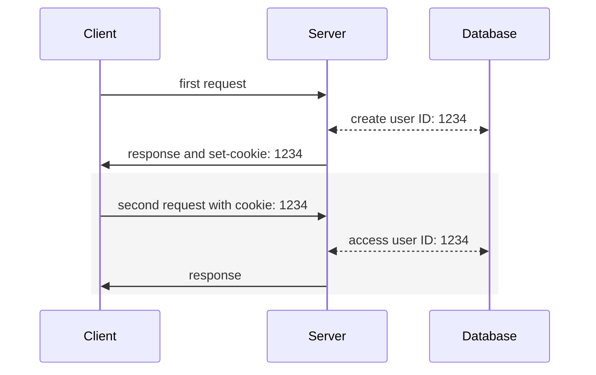

# HTTP

HyperText Transfer Protocol (HTTP), the Web’s application-layer protocol.

> RFC: [HTTP/1.0](https://datatracker.ietf.org/doc/html/rfc1945), [HTTP/1.1](https://datatracker.ietf.org/doc/html/rfc7230), [HTTP/2](https://datatracker.ietf.org/doc/html/rfc7540)

> [!TIP]
>
> **stateless**
>
> server maintains no information about the clients

## Non-Persistent and Persistent Connections

1. **non-persistent connections**

   each request/response pair be sent over a separate TCP connection, delay is 4 RTTs



2. **persistent connections**

   each request/response pair be sent over the same TCP connection, delay is 3 RTTs



## With and Without Pipelining

## Messages



1. HTTP Request Message

   ```txt
   GET /somedir/page.html HTTP/1.1
   Host: www.someschool.edu
   Connection: close
   User-agent: Mozilla/5.0
   Accept-language: fr
   ```

2. HTTP Response Message

   ```txt
   HTTP/1.1 200 OK
   Connection: close
   Date: Tue, 18 Aug 2015 15:44:04 GMT
   Server: Apache/2.2.3 (CentOS)
   Last-Modified: Tue, 18 Aug 2015 15:11:03 GMT
   Content-Length: 6821
   Content-Type: text/html

   (data data data data data ...)
   ```

## Stateless and Cookie

Because an HTTP server maintains no information about the clients,
HTTP is said to be a **stateless** protocol. However, it is often
desirable for a Web site to identify users, For this purposes, HTTP
uses **cookies**.

Cookie technology has four components:

1. a cookie header line in the HTTP response message
2. a cookie header line in the HTTP request message
3. a cookie file kept on the user’s end system and managed by the user’s browser
4. a back-end database at the Web site



1. fisrt visit
2. the server creates a unique ID, and points to the database
3. the server responds to browser, including in the HTTP response a `Set-cookie: ID` header
4. the browser receives the response, then appends a line to the cookie file (includes the hostname of the server and the ID)
5. second visit
6. the browser consults the cookie file, extracts ID for this site, and puts a cookie header line: `Cookie: ID`
7. the server fetches user information by ID
8. the server responds to browser
