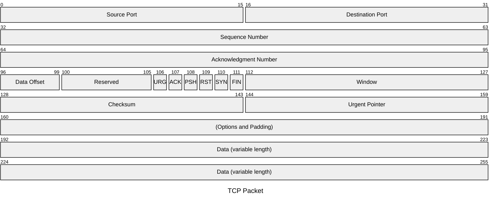
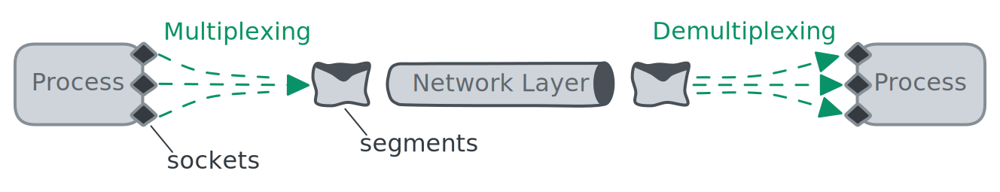
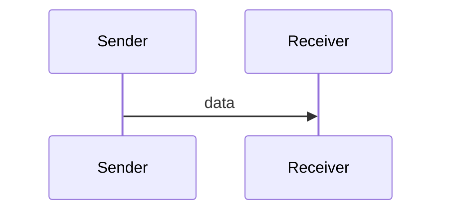
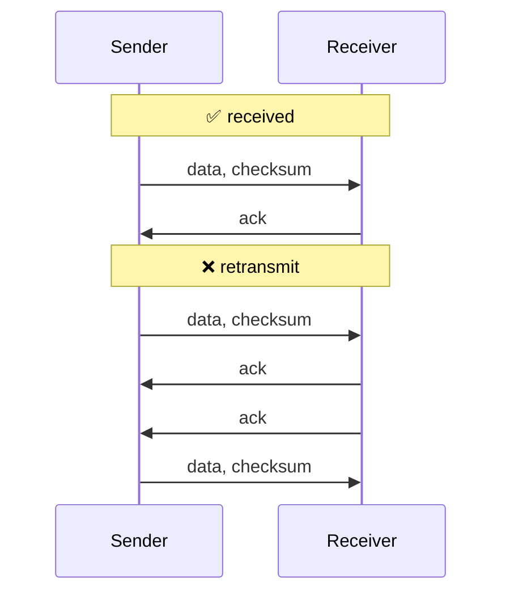
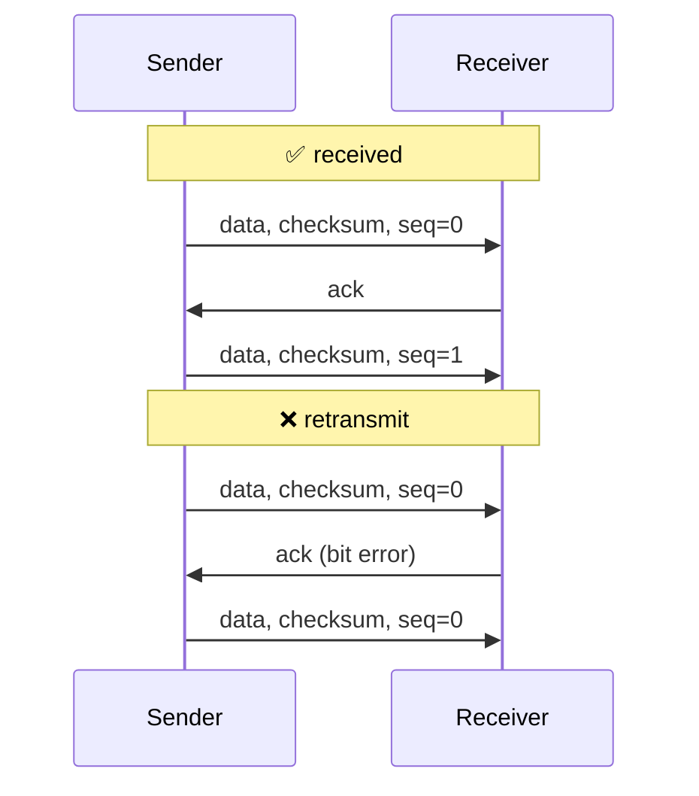
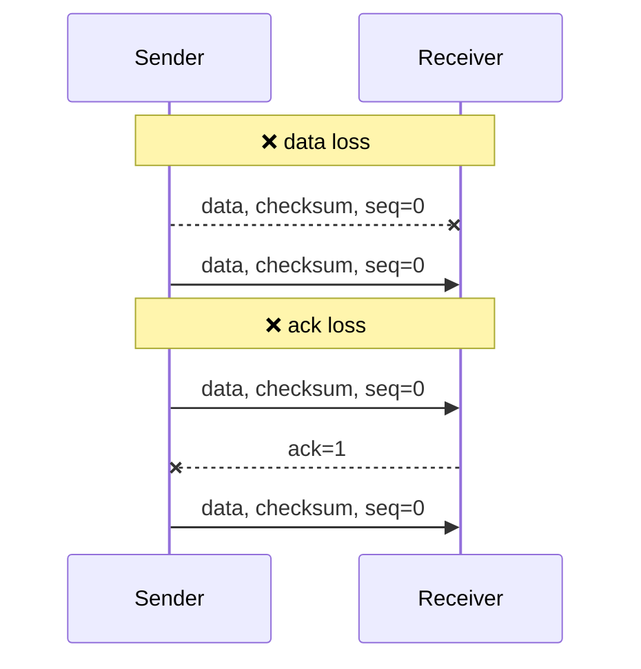
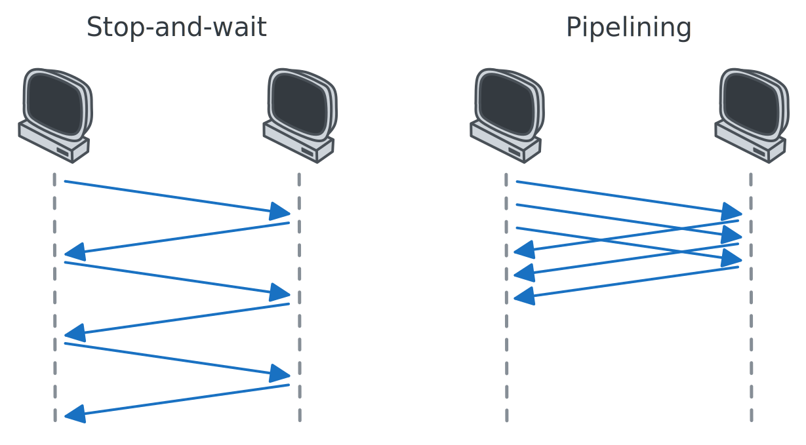
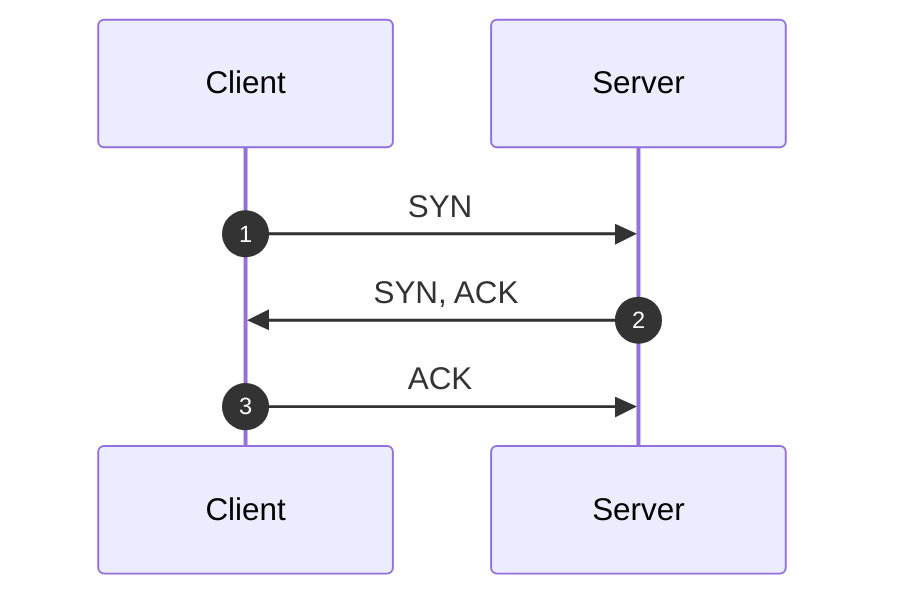
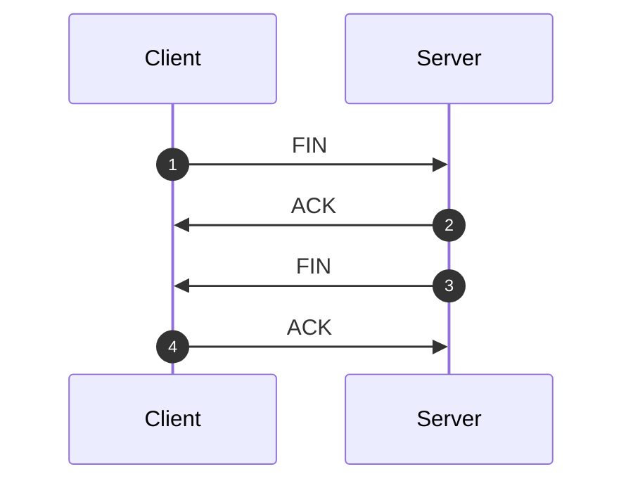

# TCP

[Transmission Control Protocol](https://datatracker.ietf.org/doc/html/rfc9293) (TCP), which provides areliable, connection-oriented service to the invoking application.

Services provided by TCP:

1. data delivery (multiplexing)
2. reliable data transfer
3. congestion control

## Header

## Multiplexing

Extending the host-to-host delivery service provided by the network layer to a **process-to-process** delivery service.

1. **multiplexing**: gathering data from different sockets, and passing the segments to the network layer
2. **demultiplexing**: delivering the data in segment to the correct socket

> [!TIP]
>
> **How does TCP identify a socket?**
>
> TCP socket is fully identified by **(source IP, source Port, destination IP, destination Port)**. if two TCP segments have different source IP or Port, they will be directed to two different sockets.

> [!TIP]
>
> **TCP requires establishing a connection**
>
> Unlike UDP, TCP requires establishing a connection. When the server receives a connection request, it creates a new socket. All subsequently arriving segments will be demultiplexed to this socket.

## Reliable Data Transfer

### ARQ (Automatic Repeat reQuest)

- 不丢包 ✅
- 不出错 ✅

假设网络层满足以上条件，实现可靠传输很简单：

---

- 不丢包 ✅
- 会出错 ❌

假设网络层满足以上条件，则需确保出错的数据被重传，实现重传机制需要增加两个字段：

1. **Checksum**: 检测数据是否出错
2. **Acknowledgment Number**: 反馈结果（返回一次表示没错，返回两次表示有错，需要重传）

如果 ACK 包也出错，那么发送方在收到错误的 ACK 包后，也需要重传数据。但此时，接收方不知道到达的数据是新数据还是重传数据，因此需要新增一个字段来区分：

1. **Sequence Number**: determine whether or not the received packet is a retransmission

---

- 会丢包 ❌
- 会出错 ❌

假设网络层满足以上条件，如果出现丢包，发送方在等待一段时间后，需要重传数据，丢包有两种情况：

1. Data 包丢了
2. ACK 包丢了

### GBN (Go-Back-N)

> [!TIP]
>
> **Stop-and-wait protocols**
>
> the sender will not send a new piece of data until it is sure that the receiver has correctly received the current packet.

由于 Stop-and-wait protocols 效率较低，需要进行 pipelining

> [!TIP]
>
> **Why not allow an unlimited number of such packets?**
>
> one reason is congestion control.

In a Go-Back-N (GBN) protocol, the sender is allowed to transmit multiple packets without waiting for an acknowledgment,

## Connection

### 三次握手

1. 客户端请求建立连接，发送 SYN 报文 (SEQ: 100)
2. 服务端返回 SYN 的 ACK，并请求建立连接，发送 SYN 报文 (SEQ: 300, ACK: 101)
3. 客户端返回 SYN 的 ACK (SEQ: 101, ACK: 301)
4. 客户端开始传数据 (SEQ: 101, ACK: 301)

### 四次挥手

1. 客户端请求断开连接，发送 FIN 报文 (SEQ: 100, ACK: 300)
2. 服务端返回 FIN 的 ACK (SEQ: 300, ACK: 101)
3. 服务端请求断开连接，发送 FIN 报文 (SEQ: 300, ACK: 101)
4. 客户端返回 FIN 的 ACK (SEQ: 101, ACK: 301)
