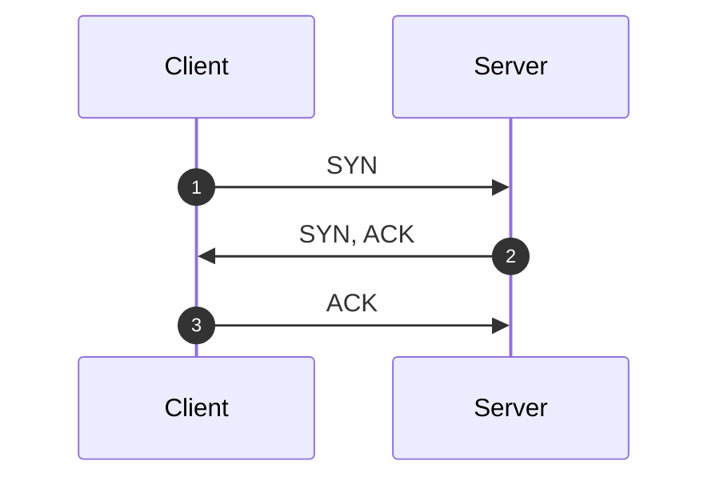
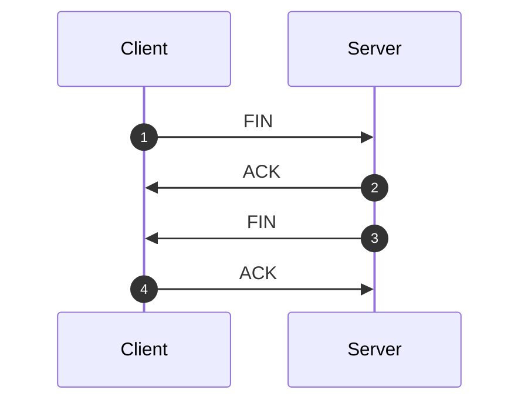

# TCP

[Transmission Control Protocol](https://datatracker.ietf.org/doc/html/rfc9293) (TCP), which provides areliable, connection-oriented service to the invoking application.

Services provided by TCP:

1. data delivery (multiplexing)
2. reliable data transfer
3. congestion control

## Multiplexing

Extending the host-to-host delivery service provided by the network layer to a **process-to-process** delivery service.

1. **multiplexing**: gathering data from different sockets, and passing the segments to the network layer
2. **demultiplexing**: delivering the data in segment to the correct socket

> [!TIP]
>
> **How does TCP identify a socket?**
>
> TCP socket is fully identified by **(source IP, source Port, destination IP, destination Port)**. if two TCP segments have different source IP or Port, they will be directed to two different sockets.

> [!TIP]
>
> **TCP requires establishing a connection**
>
> Unlike UDP, TCP requires establishing a connection. When the server receives a connection request, it creates a new socket. All subsequently arriving segments will be demultiplexed to this socket.

## Header

## Connection

### 三次握手

1. 客户端请求建立连接，发送 SYN 报文 (SEQ: 100)
2. 服务端返回 SYN 的 ACK，并请求建立连接，发送 SYN 报文 (SEQ: 300, ACK: 101)
3. 客户端返回 SYN 的 ACK (SEQ: 101, ACK: 301)
4. 客户端开始传数据 (SEQ: 101, ACK: 301)

### 四次挥手

1. 客户端请求断开连接，发送 FIN 报文 (SEQ: 100, ACK: 300)
2. 服务端返回 FIN 的 ACK (SEQ: 300, ACK: 101)
3. 服务端请求断开连接，发送 FIN 报文 (SEQ: 300, ACK: 101)
4. 客户端返回 FIN 的 ACK (SEQ: 101, ACK: 301)
