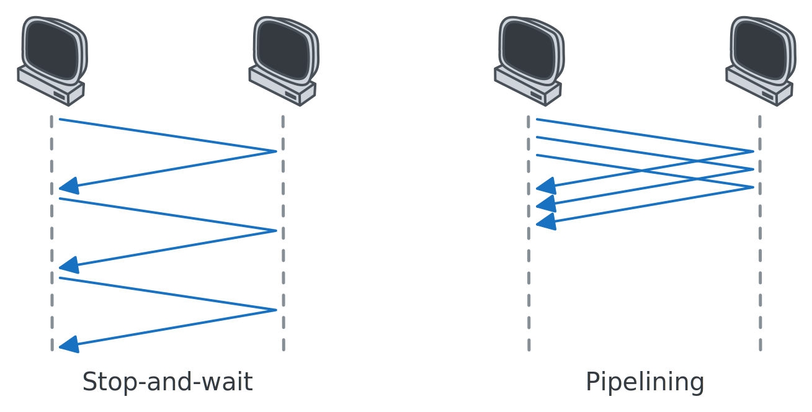
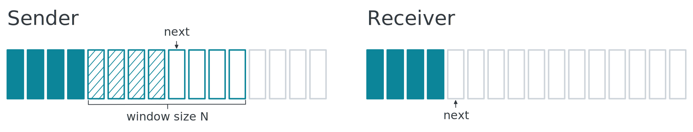
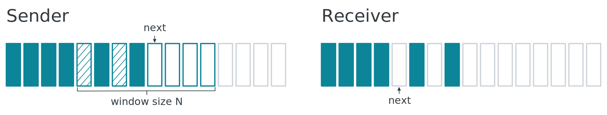

# TCP

[Transmission Control Protocol](https://datatracker.ietf.org/doc/html/rfc9293) (TCP), which provides areliable, connection-oriented service to the invoking application.

Services provided by TCP:

1. data delivery (multiplexing)
2. reliable data transfer
3. congestion control

## Header


Used for [multiplexing](#multiplexing):

- **Source Port**
- **Destination Port**

Used for [reliable data transfer](#reliable-data-transfer):

- **Sequence Number**
- **Acknowledgment Number**
- **Checksum**
- **ACK**: indicate Acknowledgment Number field is valid

User for [connection establishment](#connection-establishment):

- **SYN**
- **FIN**
- **RST**

Used for [congestion control](#congestion-control):

- **Window**

Other fields:

- **Data Offset**: the length of the TCP header (the TCP header can be of variable length)

### Sequence Numbers

Suppose that the file consisting of 500,000 bytes, that the MSS is 1,000 bytes.

- segment 1 gets assigned sequence number 0
- segment 2 gets assigned sequence number 1,000
- segment 500 gets assigned sequence number 499,000


> [!TIP]
>
> **MSS (Maximum Segment Size)**
>
> the largest amount of data.

### Acknowledgment Numbers

Suppose that Receiver has received all bytes numbered 0 through 535. Then Sender puts 536 in the acknowledgment number field.


> [!TIP]
>
> **Initial Sequence Number**
>
> In fact, TCP randomly selects the initial sequence number to avoid collisions with stale segments.
>
> **Stale segments**
>
> Segments that are still in the network but belong to a closed TCP connection.

## Multiplexing

Extending the host-to-host delivery service provided by the network layer to a **process-to-process** delivery service.

1. **multiplexing**: gathering data from different sockets, and passing the segments to the network layer
2. **demultiplexing**: delivering the data in segment to the correct socket

> [!TIP]
>
> **How does TCP identify a socket?**
>
> TCP socket is fully identified by **(source IP, source Port, destination IP, destination Port)**. if two TCP segments have different source IP or Port, they will be directed to two different sockets.

> [!TIP]
>
> **TCP requires establishing a connection**
>
> Unlike UDP, TCP requires establishing a connection. When the server receives a connection request, it creates a new socket. All subsequently arriving segments will be demultiplexed to this socket.


## Reliable Data Transfer

### ARQ (Automatic Repeat reQuest)

- 不丢包 ✅
- 不出错 ✅

假设网络层满足以上条件，实现可靠传输很简单：


---

- 不丢包 ✅
- 会出错 ❌

假设网络层满足以上条件，则需确保出错的数据被重传，实现重传机制需要增加两个字段：

1. **Checksum**: 检测数据是否出错
2. **Acknowledgment Number**: 反馈结果
   - correct: 返回一次 ACK
   - wrong: 返回两次 ACK


如果 ACK 包也出错，那么发送方在收到错误的 ACK 包后，也需要重传数据。但此时，接收方不知道到达的数据是新数据还是重传数据，因此需要新增一个字段来区分：

1. **Sequence Number**: 确定数据包是否是重传的
   - 重传的数据包：序列号和上一个包相同
   - 新的数据包：序列号和上一个包不同


---

- 会丢包 ❌
- 会出错 ❌

假设网络层满足以上条件，如果出现丢包，发送方在等待一段时间后，需要重传数据，丢包有两种情况：

1. Data 包丢了（或超时了）
2. ACK 包丢了（或超时了）


### Stop-and-wait vs Pipelining

- **Stop-and-wait protocols**: 数据包确认接收后，才能发送下一个
- **pipelining protocols**: 允许发送多个数据包而不等待确认

由下图可知 Stop-and-wait 效率低于 Pipelining



在管道协议中，数据包可能会乱序，因此 ACK 需要指定对应的 SEQ，例如：


### GBN (Go-Back-N)

GBN 是一个管道协议，但它限制了管道中数据包的数量，即窗口大小。

- 发送方重传时，会重传目标数据包，及其之后的数据包
- 接收方收到逆序数据包时，直接丢弃



### SR (Selective Repeat)

GBN 协议在某个数据包丢失或出错或乱序时，会导致大量数据包被重传，效率较低。而 SR 协议允许保留正确到达的数据包。

- 发送方重传时，只会重传目标数据包
- 接收方收到逆序数据包时，会缓存下来



> [!TIP]
>
> **序列号重复**
>
> 由于收发双方的窗口并不是同步的，当 $N < \frac{seqRange}{2}$ 时序列号可能发生重复，例如当 $N = 3$ 且 $seqRange=4$ 时
>
> ```txt
> # 发送方 seq=0,1,2 的 ACK 丢失，正在重传 seq=0
> sender window: [0, 1, 2]
> # 接收方 seq=0,1,2 已确认，窗口右移，此时若收到重传的 seq=0 则会导致错误
> receiver window: [3, 0, 1]
> ```

## Connection Establishment

### Three-way Handshake


1. 客户端请求建立连接，发送 SYN 报文 (SEQ: 100)
2. 服务端返回 SYN 的 ACK，并请求建立连接，发送 SYN 报文 (SEQ: 300, ACK: 101)
3. 客户端返回 SYN 的 ACK (SEQ: 101, ACK: 301)
4. 客户端开始传数据 (SEQ: 101, ACK: 301)

### 四次挥手


1. 客户端请求断开连接，发送 FIN 报文 (SEQ: 100, ACK: 300)
2. 服务端返回 FIN 的 ACK (SEQ: 300, ACK: 101)
3. 服务端请求断开连接，发送 FIN 报文 (SEQ: 300, ACK: 101)
4. 客户端返回 FIN 的 ACK (SEQ: 101, ACK: 301)
