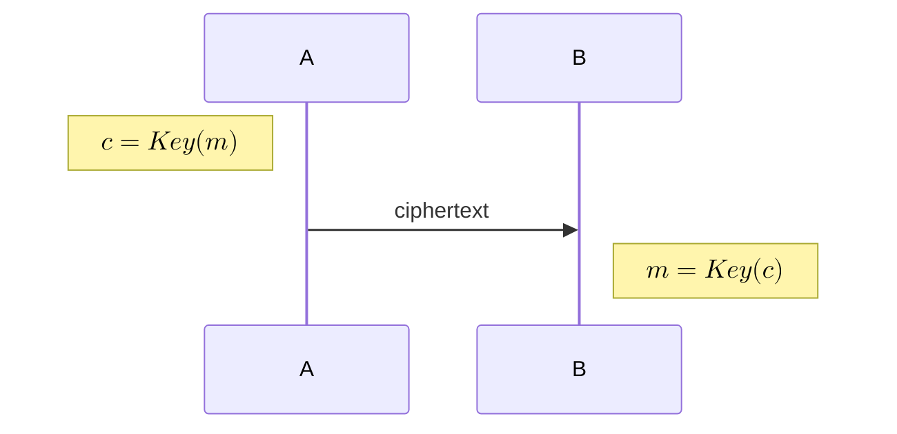
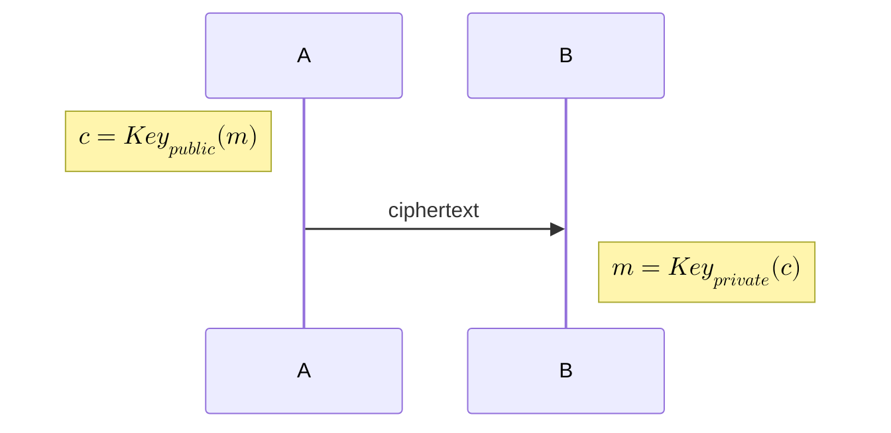
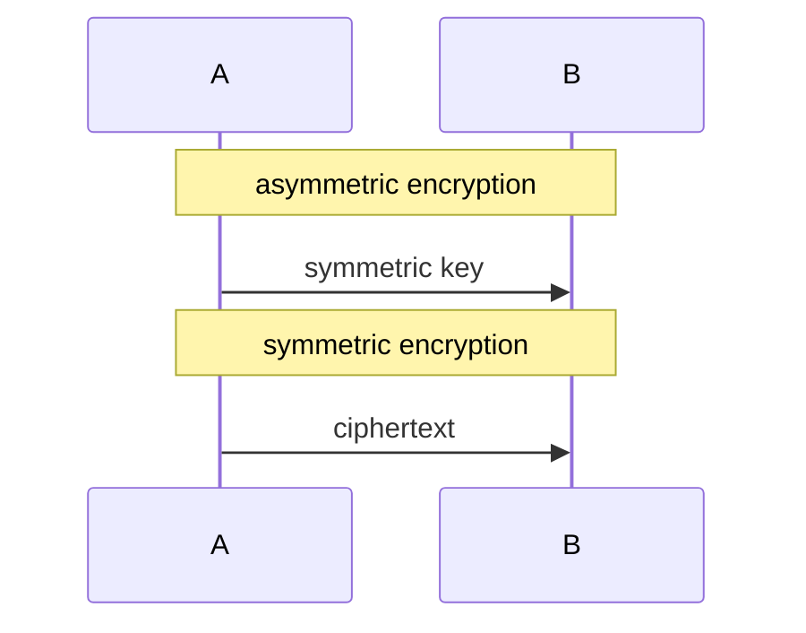
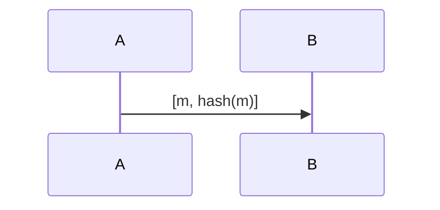
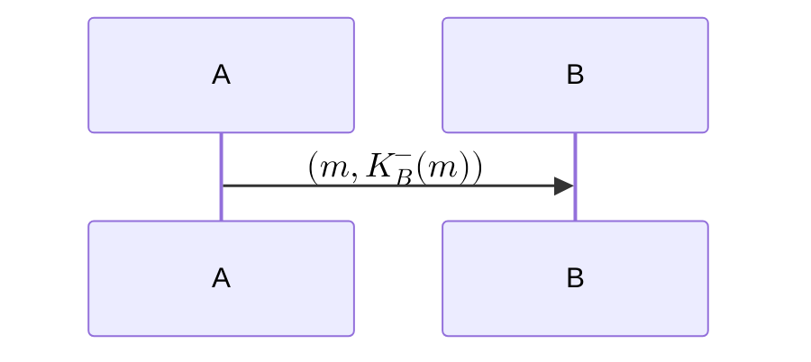
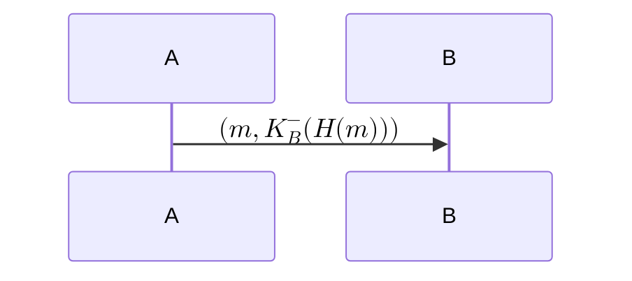
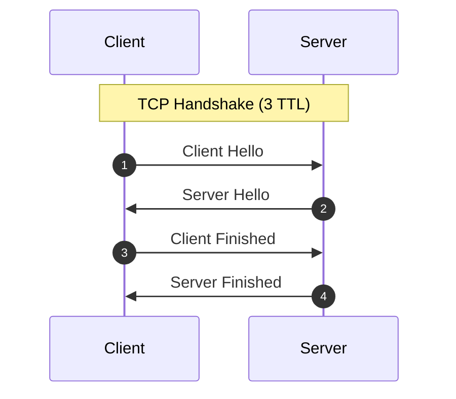

# TLS

Transport Layer Security (TLS)

安全通信需要满足以下条件:

- 机密性 (Confidentiality): 使用[加密算法](#加密算法)，保证只有通信双方能理解内容
- 完整性 (Integrity): 使用[摘要算法](#摘要算法)，保证内容没有被篡改
- 身份验证 (Authentication): 使用[身份验证](#身份验证)，保证通信双方能验证对方的身份

## 加密算法

我们可以使用**对称加密算法**，来进行加密通信，但这种方法需要通信双方提前共享一个**对称密钥**

**非对称加密算法**不需要提前共享密钥

由于非对称加密计算量较大，因此通常先使用非对称加密来交换对称密钥，然后进行对称加密通信

### RSA

**Key Generation**

1. Choose two large prime numbers `p` and `q`
2. Compute `n = pq` and `z = (p - 1)(q - 1)`
3. Choose a number `e` less than `n` such that `e` and `z` are coprime
4. Choose a number `d` such that `ed mod z = 1`
5. Finally, the public key is `(n, e)` and the private key is `(n, d)`

**Encryption and Decryption**

- Encryption: $c = m^e \mod n$
- Decryption: $m = c^d \mod n$

Where $m < n$

### DH

## 摘要算法

我们可以使用**哈希函数**，来进行完整性验证

## 数字签名

使用私钥对消息进行签名，可以验证 $K^-_B(m)$ 能否被 $K^+_B$ 解密，从而验证身份

由于私钥加密计算量较大，因此通常对哈希值进行加密

我们还需要确认公钥确实是 B 的，因此需要 CA 提供数字证书，证书中包含了 B 的公钥和 IP 等信息

- certificate: $K^-_{CA}(K^+_B, IP_B)$

> [!TIP]
>
> $K^-_B(m)$ 也可以用来验消息完整性

## TLS 1.2

- **Step 1**
  - 💬 version list
  - 💬 algorithm list
  - 💬 client random
- **Step 2**
  - 💬 selected version
  - 💬 selected algorithm
  - 💬 server random
  - 💬 certificate
  - ⚙️ exchange key generation: the server calculates a private/public keypair for key exchange
  - 💬 server public key
- **Step 3**
  - ⚙️ exchange key generation: the client calculates a private/public keypair for key exchange
  - 💬 client public key
  - ⚙️ encryption keys caculation: the client calculate the encryption keys use (server random, client random, server public key, client private key)
  - 💬 verification data: built from a hash of all handshake messages and encrypts it with the client private key
- **Step 4**
  - ⚙️ encryption keys caculation: the server calculate encryption keys use (server random, client random, client public key, server private key)
  - 💬 verification data: built from a hash of all handshake messages and encrypts it with the server private key

> [!TIP]
>
> **random** is used to prevent **playback attack**
>
> **verification data** is used to verify the integrity of the handshake messages
