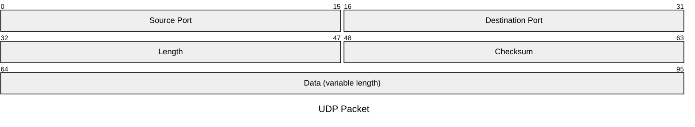

# UDP

User Datagram Protocol, [RFC 768](https://datatracker.ietf.org/doc/html/rfc768)

## Header

```mermaid
packet-beta
title UDP Packet
0-15: "Source Port"
16-31: "Destination Port"
32-47: "Length"
48-63: "Checksum"
64-95: "Data (variable length)"
```
