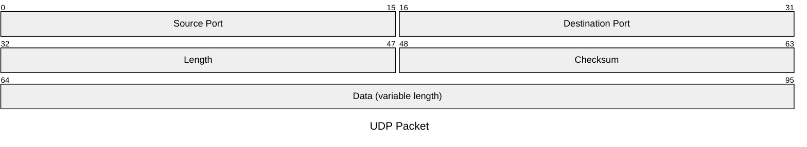

# UDP

[User Datagram Protocol](https://datatracker.ietf.org/doc/html/rfc768) (UDP),
which provides an unreliable, connectionless service to the invoking application.

Services provided by UDP:

1. data delivery (multiplexing)
2. error checking

## Header

- Port: used to multiplexing
- Length: the number of bytes in the UDP segment (header plus data)
- Checksum: used by the receiving host to check whether errors have been introduced into the segment

## Multiplexing

Extending the host-to-host delivery service provided by the network layer to a **process-to-process** delivery service.

1. **multiplexing**: gathering data from different sockets, and passing the segments to the network layer
2. **demultiplexing**: delivering the data in segment to the correct socket

> [!TIP]
>
> **How does UDP identify a socket?**
>
> UDP socket is fully identified by **(destination IP, destination Port)**. if two UDP segments have different source IP or Port, but have the same destination IP and Port, they will be directed to the same process via the same socket.

## Checksum

> [!TIP]
>
> **Why UDP provides a checksum?**
>
> 1. may use a link-layer protocol that does not provide error checking
> 2. bit errors could be introduced when a segment is stored in a router’s memory
