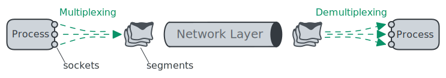

# UDP

[User Datagram Protocol](https://datatracker.ietf.org/doc/html/rfc768) (UDP),
which provides an unreliable, connectionless service to the invoking application.

Services provided by UDP:

1. data delivery
2. error checking

## Multiplexing

1. **multiplexing**: gathering data from different sockets, and passing the segments to the network layer
2. **demultiplexing**: delivering the data in a transport-layer segment to the correct socket

Each socket in the host could be assigned a port number, and when
a segment arrives at the host, the transport layer examines the destination port
number in the segment and directs the segment to the corresponding socket.

## Header

