# Git

## Init

Git Init 会初始化一个代码仓库，例如：

1. `git init`: 在当前目录下初始化一个代码仓库

### 新建仓库

```
fruits
├── apple.txt
└── banana.txt
```

假设有以上目录结构，在 `fruits` 路径下执行 `git init` 后，Git 会做以下事情：

1. 创建一个 .git 文件
   ```diff
   fruits
     ├── apple.txt
     ├── banana.txt
   + └── .git
   +   ├── config
   +   ├── description
   +   ├── HEAD
   +   ├── index
   +   ├── hooks
   +   │   └── samples
   +   ├── info
   +   │   └── exclude
   +   ├── objects
   +   │   ├── info
   +   │   └── pack
   +   └── refs
   +       ├── heads
   +       └── tags
   ```

## Add

Git Add 使用[文件通配符]()，将 Working Tree 的文件添加到 Index，例如：

1. `git add hello.txt`: 添加 hello.txt
2. `git add fruits`: 添加 fruits 目录下所有文件
3. `git add .`: 添加所有文件
4. `git add *.js`: 添加所有 js 文件

### 添加单个文件

```
// hello.txt
hello
```

假设有以上文件，执行 `git add hello.txt` 后，Git 会做以下事情：

1. 在 objects 目录下生成一个 blob 对象，其内容为 'hello'，文件名为 'hello' 的哈希值

   ```diff
   + .git/objects/ce01362
   ```

   ```sh
   $ git cat-file -t ce01362 # type
   blob

   $ git cat-file -p ce01362 # value
   hello
   ```

2. 在 Index 中添加一条记录，记录文件路径和哈希值

   ```diff
   - .git/index
   + .git/index
   ```

   ```sh
   $ git ls-files -s # index
   ce01362 hello.txt
   ```

> [!NOTE]
> 当两个文件的内容相同时，它们的哈希值也相同，因此只会生成一个 blob 对象

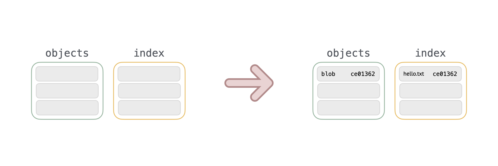

### 添加嵌套文件

```txt
// greets/hello.txt
hello
```

若添加的是嵌套文件，Git 处理也几乎一样：

1. 在 objects 目录下生成一个 blob 对象

   ```diff
   + .git/objects/ce01362
   ```

   ```sh
   $ git cat-file -t ce01362 # type
   blob

   $ git cat-file -p ce01362 # value
   hello
   ```

2. 在 index 中添加一条记录

   ```diff
   - .git/index
   + .git/index
   ```

   ```sh
   $ git ls-files -s # index
   ce01362 greets/hello.txt # 这里不一样
   ```

> [!NOTE]
> Git 看不到文件夹，仅创建文件夹不会被 Git 管理

## Commit

Git Commit 会将 Index 中的内容提交到 Repository，例如：

1. `git commit`: 提交 Index 中的内容，并打开 [Vim](../vim-cheet-sheet.md) 输入提交信息
2. `git commit -m 'update'`: 提交 Index 中的内容，并使用 'update' 作为提交信息
3. `git commit --amend`: 等价于 `git reset --soft HEAD~1` 加 `git commit`（参考 [Reset](#reset) 和 [Commit](commit)）

### 提交单个文件

```txt
4c479de apple.txt
```

假设 Index 中有以上内容，执行 `git commit -m 'update'` 后，Git 会做以下事情：

1. 在 objects 目录下生成一个 tree 对象，内容为 Index 中文件的快照

   ```diff
   + .git/objects/1742682
   ```

   ```sh
   $ git cat-file -t 1742682 # type
   tree

   $ git cat-file -p 1742682 # value
   blob 4c479de apple.txt
   ```

2. 在 objects 目录下生成一个 commit 对象，记录了刚刚的 tree 对象，和相关的提交信息

   ```diff
   + .git/objects/6cc8ff6
   ```

   ```sh
   $ git cat-file -t 6cc8ff6 # type
   commit

   $ git cat-file -p 6cc8ff6 # value
   tree 1742682
   author wdyjwdy <email.com>
   committer wdyjwdy <email.com>

   update
   ```

3. 更新[当前分支](#当前分支与当前提交)指针，指向刚刚生成的 commit 对象

   ```diff
   - .git/refs/heads/main
   + .git/refs/heads/main
   ```

   ```sh
   $ cat .git/refs/heads/main # value
   6cc8ff6
   ```

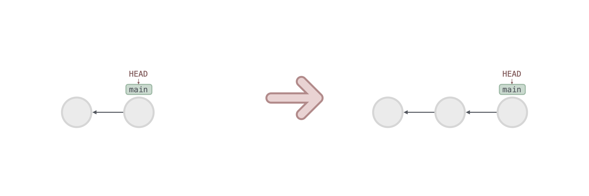

### 提交嵌套文件

```txt
4c479de fruits/apple.txt
```

若 Index 有如上嵌套文件，则 Git 会用 tree in tree 的方式来储存文件快照

1. 在 objects 目录下生成第一个 tree 对象，记录了 fruits 目录下文件的快照

   ```diff
   + .git/objects/1742682
   ```

   ```sh
   $ git cat-file -t 1742682 # type
   tree

   $ git cat-file -p 1742682 # value
   blob 4c479de apple.txt
   ```

2. 在 objects 目录下生成第二个 tree 对象，记录了 root 目录下文件的快照

   ```diff
   + .git/objects/5635283
   ```

   ```sh
   $ git cat-file -t 5635283 # type
   tree

   $ git cat-file -p 5635283 # value
   tree 1742682 fruits # 指向第一步的 tree 对象
   ```

3. 在 objects 目录下生成一个 commit 对象，记录了第二步的 tree 对象，和相关的提交信息

   ```diff
   + .git/objects/c2594b5
   ```

   ```sh
   $ git cat-file -t c2594b5 # type
   commit

   $ git cat-file -p c2594b5 # value
   tree 5635283
   author wdyjwdy <email.com>
   committer wdyjwdy <email.com>

   update
   ```

4. 更新[当前分支](#当前分支与当前提交)指针，指向刚刚生成的 commit 对象

## Branch

Git Branch 会创建一个新的分支，例如：

1. `git branch feat`: 创建一个名为 feat 的分支
2. `git branch -d feat`: 删除 feat 分支
3. `git branch -D feat`: 强制删除 feat 分支
4. `git branch`: 显示本地分支
5. `git branch -r`: 显示远程分支
6. `git branch -a`: 显示本地和远程分支

### 新建分支

```
846aac5 (HEAD -> main) commit 3
d58f2f5 commit 2
43bed3d commit 1
```

假设有以上提交历史，在 main 分支上执行 `git branch feat` 后，Git 会做以下事情：

1. 在 refs/heads 目录下创建一个名为 feat 的文件，内容为[当前提交](#当前分支与当前提交)

   ```diff
   + .git/refs/heads/feat
   ```

   ```sh
   $ cat refs/heads/feat # value
   846aac5
   ```

操作完成后，历史记录如下：

```
846aac5 (HEAD -> main, feat) commit 3
d58f2f5 commit 2
43bed3d commit 1
```

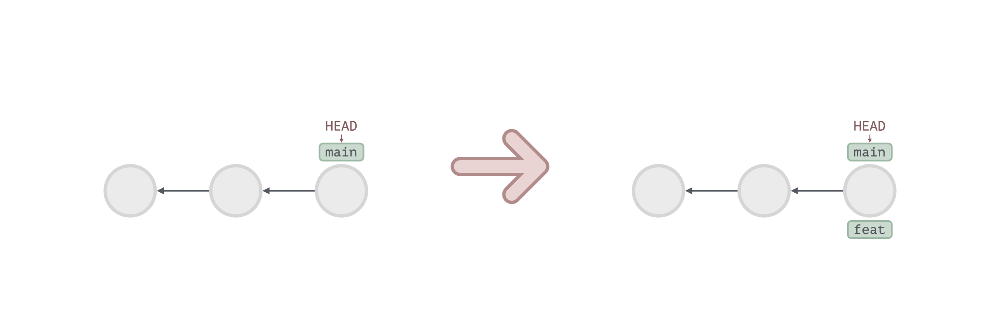

### 删除分支

```
846aac5 (HEAD -> main, feat) commit 3
d58f2f5 commit 2
43bed3d commit 1
```

假设有以上提交历史，执行 `git branch -d feat` 后，Git 会做以下事情：

1. 删除 refs/heads 目录下的 feat 文件

   ```diff
   - .git/refs/heads/feat
   ```

操作完成后，历史记录如下：

```
846aac5 (HEAD -> main) commit 3
d58f2f5 commit 2
43bed3d commit 1
```

> [!NOTE]
> 删除分支后，分支上的 commit 对象并不会被删除，这些对象会变成垃圾对象

### 当前分支与当前提交

1. 查看 HEAD 文件，获取当前分支的引用

   ```sh
   $ cat .git/HEAD # value
   ref: refs/heads/main
   ```

2. 查看当前分支的最新提交

   ```sh
   $ cat .git/refs/heads/main # value
   846aac5
   ```

## Switch

Git Switch 会切换分支，例如：

1. `git switch feat`: 切换到 feat 分支
2. `git switch -c feat`: 创建并切换到 feat 分支
3. `git switch --detach 6cc8ff6`: 切换到 6cc8ff6 提交

### 切换到分支

```
846aac5 (HEAD -> main, feat) commit 3
d58f2f5 commit 2
43bed3d commit 1
```

假设有以上提交历史，执行 `git switch feat` 后，Git 会做以下事情：

1. 更新 HEAD 文件，将其指向 feat 分支

   ```diff
   - .git/HEAD
   + .git/HEAD
   ```

   ```sh
   $ cat .git/HEAD # value
   ref: refs/heads/feat
   ```

2. 更新 Index，内容为 feat 分支对应 tree 的内容

   ```diff
   - .git/index
   + .git/index
   ```

3. 更新 Working Tree，内容为 feat 分支对应 tree 的内容

操作完成后，历史记录如下：

```
846aac5 (HEAD -> feat, main) commit 3
d58f2f5 commit 2
43bed3d commit 1
```

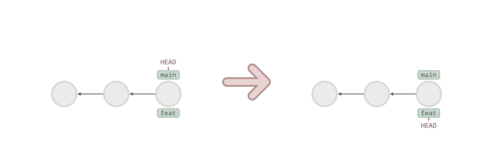

### 切换到提交

```
846aac5 (HEAD -> main) commit 3
d58f2f5 commit 2
43bed3d commit 1
```

假设有以上提交历史，执行 `git switch --detach d58f2f5` 后，Git 会做以下事情：

1. 更新 HEAD 文件，将其指向 d58f2f5 (commit 2)

   ```diff
   - .git/HEAD
   + .git/HEAD
   ```

   ```sh
   $ cat .git/HEAD # value
   d58f2f5
   ```

2. 更新 Index，内容为 d58f2f5 (commit 2) 对应 tree 的内容

   ```diff
   - .git/index
   + .git/index
   ```

3. 更新 Working Tree，内容为 d58f2f5 (commit 2) 对应 tree 的内容

操作完成后，历史记录如下：

```
846aac5 (main) commit 3
d58f2f5 (HEAD) commit 2
43bed3d commit 1
```

> [!NOTE]
> 如果想基于该提交工作，可以执行 `git switch -c <name>` 创建一个新分支开始工作

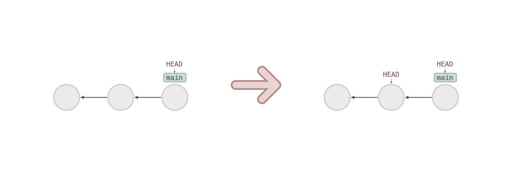

## Merge

Git Merge 会合并分支，例如：

1. `git merge feat`: 将 feat 分支合并到当前分支

### 快速合并

```sh
* b0cd9f5 (feat) commit 3
* e1e6af3 (HEAD -> main) commit 2
* 1b157d3 commit 1
```

假设有以上提交历史，feat 为 main 的直接后继节点，此时我们在 main 分支执行 `git merge feat` 后，Git 会做以下事情：

1. 更新 ORIG_HEAD 指针，指向 main 分支的最新提交，即 commit 2

   ```diff
   - .git/ORIG_HEAD
   + .git/ORIG_HEAD
   ```

   ```sh
   $ cat .git/ORIG_HEAD # value
   e1e6af3
   ```

2. 更新 main 分支指针，指向 feat 分支的最新提交，即 commit 3

   ```diff
   - .git/refs/heads/main
   + .git/refs/heads/main
   ```

   ```sh
   $ cat .git/refs/heads/main # value
   b0cd9f5
   ```

操作完成后，历史记录如下：

```sh
* b0cd9f5 (HEAD -> main, feat) commit 3
* e1e6af3 commit 2
* 1b157d3 commit 1
```

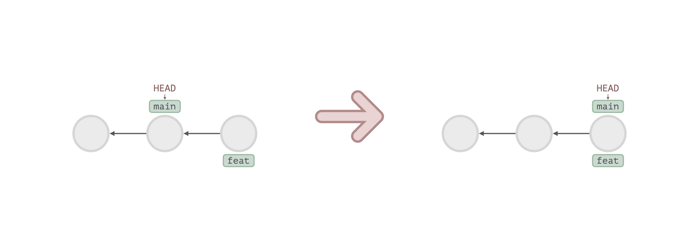

### 三路合并

```sh
* a9532ef (HEAD -> main) commit 3
| * 88d8b74 (feat) commit 2
|/
* 34b711b commit 1
```

假设有以上提交历史，feat 不是 main 的直接后继节点，此时我们在 main 分支执行 `git merge feat` 后，Git 会做以下事情：

1. 更新 ORIG_HEAD 指针，指向 main 分支的最新提交，即 commit 3

   ```diff
   - .git/ORIG_HEAD
   + .git/ORIG_HEAD
   ```

   ```sh
   $ cat .git/ORIG_HEAD # value
   a9532ef
   ```

2. 创建一个新提交，记录了 feat 中的修改

   ```diff
   # tree
   + .git/objects/03b2125
   # commit
   + .git/objects/cbd588d
   ```

   ```sh
   $ git cat-file -p cbd588d # value
   tree 03b2125
   parent a9532ef # commit 3
   parent 88d8b74 # commit 2
   author wdyjwdy <email.com>
   committer wdyjwdy <email.com>

   Merge branch 'feat'
   ```

3. 更新 main 分支指针，指向刚刚的提交对象

   ```diff
   - .git/refs/heads/main
   + .git/refs/heads/main
   ```

   ```sh
   $ cat .git/refs/heads/main # value
   cbd588d
   ```

操作完成后，历史记录如下：

```sh
*   cbd588d (HEAD -> main) Merge branch 'feat'
|\
| * 88d8b74 (feat) commit 2
* | a9532ef commit 3
|/
* 34b711b commit 1
```

> [!NOTE]
> 注意，Merge 操作产生的提交，有两个 parent，即两个父节点

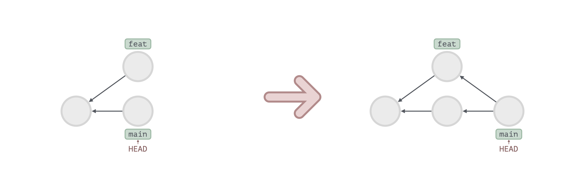

### 三路合并产生冲突

```sh
* fb1c925 (feat) commit 3
| * bcf8030 (HEAD -> main) commit 2
|/
* ccf620f commit 1
```

假设有以上提交历史，如果 feat 和 main 分支在同一行上都有修改，此时执行 `git merge feat` 会产生冲突，Git 会做以下事情：

1. 更新 ORIG_HEAD 指针
2. 新增或修改一些文件，用于解决冲突

   ```diff
   # 记录冲突文件的三个版本
   - .git/index
   + .git/index
   ```

   ```sh
   $ git ls-files -s # value
   4c479de	apple.txt # commit 1 (root)
   4a77268	apple.txt # commit 2 (main)
   29b651e	apple.txt # commit 3 (feat)
   ```

   ```diff
   # 用户解决冲突的文件
   # tree
   + .git/objects/b3535c9
   # blob
   + .git/objects/675e90a
   ```

   ```sh
   $ git cat-file -p 675e90 # value
   apple
   <<<<<<< HEAD
   banana
   =======
   cherry
   >>>>>>> feat
   ```

   ```diff
   # 记录冲突的状态
   .git
   + ├── AUTO_MERGE # 指向解决冲突的文件
   + ├── MERGE_HEAD # 指向 feat 分支的最新提交
   + ├── MERGE_MODE # 合并模式
   + └── MERGE_MSG  # merge commit message
   ```

3. 用户解决冲突，即暂存了所有解决冲突的文件后，执行 `git commit` 命令手动进行提交
4. 更新 main 分支指针

操作完成后，历史记录如下：

```sh
*   ab3525e (HEAD -> main) Merge branch 'feat'
|\
| * fb1c925 (feat) commit 3
* | bcf8030 commit 2
|/
* ccf620f commit 1
```

> [!NOTE]
> Merge 操作完成后，中间状态产生的文件会被删除

### ORIG_HEAD 是做什么工作的

Merge 操作时会更新 ORIG_HEAD，指向 Merge 前的 commit 对象，
需要撤销刚刚的 Merge 操作时，可以执行 `git reset ORIG_HEAD`

## Rebase

Rebase 会将提交重新应用到指定分支，例如：

1. `git rebase main`: 将当前分支的 commit 重新提交到 main 分支上

### 应用分支

```
* fda4ab8 (feat) commit 3
| * 3007e64 (HEAD -> main) commit 2
|/
* 2239c5b commit 1
```

假设有以上提交历史，此时我们在 feat 分支执行 `git rebase main` 后，Git 会做以下事情：

1. 将 feat 分支中 root 节点之后的 commit（即 commit 3），重新提交到 main 分支上

   ```diff
   # tree
   + .git/objects/830241f
   # commit
   + .git/objects/37ffdf1
   ```

2. 更新 feat 分支指针，指向最新 commit

   ```diff
   - .git/refs/heads/feat
   + .git/refs/heads/feat
   ```

   ```sh
   $ cat .git/refs/heads/feat # value
   37ffdf1
   ```

操作完成后，历史记录如下：

```sh
* 37ffdf1 (feat) commit 3
* 3007e64 (HEAD -> main) commit 2
* 2239c5b commit 1
```

> [!CAUTION]
> 注意 rebase 后的 commit 哈希值会改变

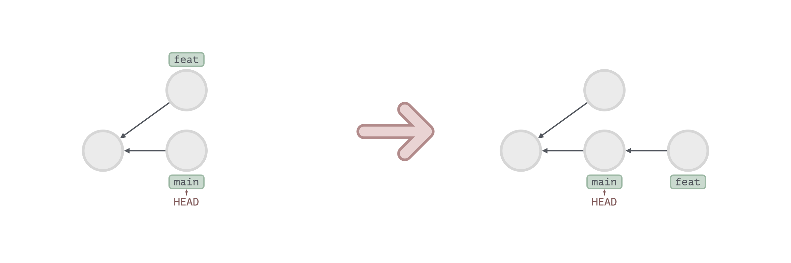

### 应用分支产生冲突

和[带冲突的三路合并](#带冲突的三路合并)几乎一样，只有以下区别：

1. 当有多个 commit 需要处理时，rebase 会逐个处理 commit 的冲突，而 merge 会一次性处理所有 commit 的冲突
2. rebase 会新增多个 commit，而 merge 只会新增一个 commit
3. rebase 会移动 feat 分支指针，而 merge 会移动 main 分支指针

## Cherry-pick

Git Cherry-pick 会将指定 commit 重新应用到当前分支，例如：

1. `git cherry-pick A`: 将 commit A 应用到当前分支
2. `git cherry-pick A B`: 将 commit A, B 应用到当前分支
3. `git cherry-pick A..D`: 将 commit B, C, D 应用到当前分支

### 应用单个提交

```
A <- B <- C <- D (main)
      \
       E <- F (feat)
```

假设有以上提交历史，此时我们在 feat 分支执行 `git cherry-pick D` 后，Git 会做以下事情：

1. 将 commit D 应用到 feat 分支

操作完成后，历史记录如下：

```
A <- B <- C <- D (main)
      \
       E <- F <- D' (feat)
```

### 应用多个提交

```
A <- B <- C <- D <- E (main)
      \
       F <- G (feat)
```

假设有以上提交历史，此时我们在 feat 分支执行 `git cherry-pick C..E` 后，Git 会做以下事情：

1. 将 commit D, E 应用到 feat 分支

操作完成后，历史记录如下：

```
A <- B <- C <- D <- E (main)
      \
       F <- G <- D' <- E' (feat)
```

## Tag

Git Tag 会为指定提交创建一个标签，例如：

1. `git tag v1`: 为当前提交，创建一个名为 'v1' 的标签
2. `git tag -a v1 -m 'version 1'`: 为当前提交，创建一个名为 'v1' 的标签，标签信息为 'version 1'
3. `git tag -a v1 2239c5b`: 为指定提交，创建一个名为 'v1' 的标签
4. `git tag`: 列出所有标签
5. `git tag -d v1`: 删除名为 'v1' 标签

### 创建简单标签

```
a0f247e (HEAD -> main) commit 3
57ca93f commit 2
e7f88c9 commit 1
```

假设有以上提交历史，此时执行 `git tag v1` 后，Git 会做以下事情：

1. 在 refs/tags 目录下创建一个名为 v1 的文件，内容为[当前提交](#当前分支与当前提交)

   ```diff
   + .git/refs/tags/v1
   ```

   ```sh
   $ cat .git/refs/tags/v1 # value
   a0f247e
   ```

操作完成后，历史记录如下：

```
a0f247e (HEAD -> main, tag: v1) commit 3
57ca93f commit 2
e7f88c9 commit 1
```

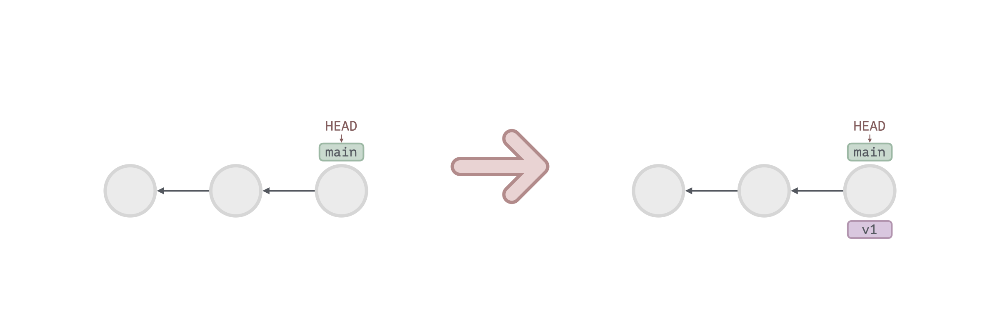

### 创建内容标签

```
a0f247e (HEAD -> main) commit 3
57ca93f commit 2
e7f88c9 commit 1
```

假设有以上提交历史，此时执行 `git tag -a v1 -m 'version 1'` 后，Git 会做以下事情：

1. 在 refs/tags 目录下创建一个名为 v1 的文件，内容为[当前提交](#当前分支与当前提交)

   ```diff
   + .git/refs/tags/v1
   ```

   ```sh
   $ cat .git/refs/tags/v1 # value
   a0f247e
   ```

2. 在 objects 目录下创建一个 tag 对象，内容为 tag message

   ```diff
   + .git/objects/adf306e
   ```

   ```sh
   $ git cat-file -t adf306e # type
   tag

   $ git cat-file -p adf306e # value
   object a0f247e
   type commit
   tag v1
   tagger wdyjwdy <email.com>

   version 1
   ```

操作完成后，历史记录如下：

```
a0f247e (HEAD -> main, tag: v1) commit 3
57ca93f commit 2
e7f88c9 commit 1
```

> [!NOTE]
> 删除内容标签后，tag 对象不会被删除，成为了垃圾对象

## Clone

Git Clone 会将 Github 上的代码仓库克隆到本地，例如：

1. `git clone <url>`: 克隆仓库

### 克隆远程仓库

```sh
# remote
98890cc (HEAD -> main) commit 3
5650cb4 commit 2
8c7a5ee commit 1

# local
```

假设有以上提交历史，在本地执行 `git clone <url>` 后，Git 会做以下事情：

1. 下载 .git 文件，并重建工作区

   ```diff
   # Working Tree
   + hello.txt

   # Repository
   + .git
   ```

操作完成后，历史记录如下：

```sh
# local
98890cc (HEAD -> main, origin/main, origin/HEAD) commit 3
5650cb4 commit 2
8c7a5ee commit 1
```

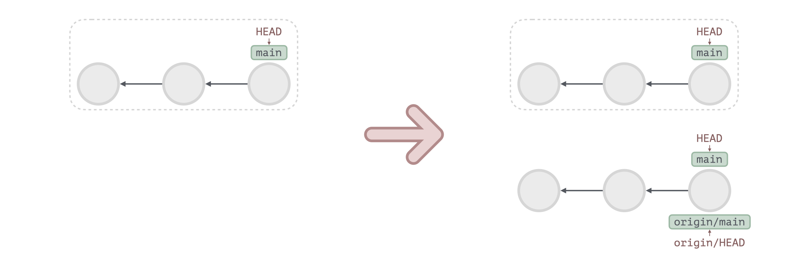

与在本地 init 的仓库相比，clone 下来的仓库，有以下一些变化：

1. config 文件增加了远程分支的信息

   ```diff
   + [remote "origin"]
   +    url = https://github.com/wdyjwdy/learn-git.git
   +    fetch = +refs/heads/*:refs/remotes/origin/*
   + [branch "main"]
   +    remote = origin
   +    merge = refs/heads/main
   ```

2. objects 目录下的对象会被打包

   ```diff
   + packed-refs
     objects
     └── pack
   +     ├── pack-ebd0add.idx
   +     └── pack-ebd0add.pack
   ```

3. refs 目录下增加了远程分支的引用

   ```diff
   + refs/remotes/origin/HEAD
   ```

## Fetch

Git Fetch 会同步远程仓库的代码到本地，例如：

1. `git fetch`: 同步远程仓库

### 同步远程仓库

```sh
# remote
98890cc (HEAD -> main) commit 3
5650cb4 commit 2
8c7a5ee commit 1

# local
5650cb4 (HEAD -> main) commit 2
8c7a5ee commit 1
```

假设有以上提交历史，在本地执行 `git fetch` 后，Git 会做以下事情：

1. 在 objects 目录下生成远程新提交的相关对象（即 commit 3）

   ```diff
   # blob, tree, commit
   objects
   + ├── 38ea824
   + ├── 1318e47
   + └── 98890cc
   ```

2. 更新 origin/main 分支指针，指向远程最新提交（即 commit 3）

   ```diff
   - .git/refs/remotes/origin/main
   + .git/refs/remotes/origin/main
   ```

   ```sh
   $ cat .git/refs/remotes/origin/main # value
   98890cc
   ```

3. 更新 FETCH_HEAD，记录了本次 fetch 时，远程仓库的 commit, branch, url

   ```diff
   - FETCH_HEAD
   + FETCH_HEAD
   ```

   ```sh
   $ cat .git/FETCH_HEAD # value
   98890cc branch 'main' of <url>
   ```

操作完成后，历史记录如下：

```sh
# local
98890cc (origin/main, origin/HEAD) commit 3
5650cb4 (HEAD -> main) commit 2
8c7a5ee commit 1
```

> [!NOTE]
> 注意，`git fetch` 命令不会更新本地的 main 分支指针


### FETCH_HEAD 是做什么工作的

Fetch 操作时会更新 FETCH_HEAD，指向了所 Fetch 的远程分支，
在指向 Pull 操作时，用来确定所 Merge 的目标

## Pull

Git Pull 会拉取远程仓库的代码到本地，例如：

1. `git pull`: 拉取远程仓库

### 拉取远程仓库

```sh
# remote
98890cc (HEAD -> main) commit 3
5650cb4 commit 2
8c7a5ee commit 1

# local
5650cb4 (HEAD -> main, origin/main, origin/HEAD) commit 2
8c7a5ee commit 1
```

假设有以上提交历史，在本地执行 `git pull` 后，Git 会做以下事情：

1. 执行 `git fetch`（见 [fetch](#fetch) 部分）
2. 执行 `git merge origin/main`（见 [merge](#merge) 部分）

拉取成功后，历史记录如下：

```sh
# local
98890cc (HEAD -> main, origin/main, origin/HEAD) commit 3
5650cb4 commit 2
8c7a5ee commit 1
```

> [!NOTE]
> 这里演示的是快速合并，如果是三路合并的话，则会产生一次新的提交

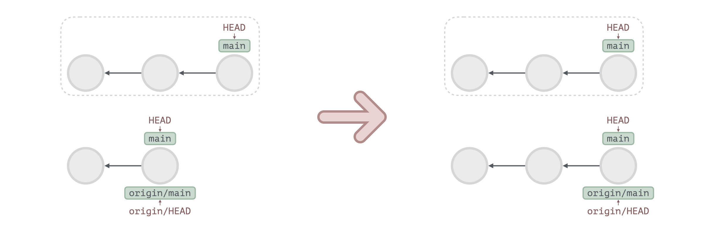

### 拉取远程仓库产生冲突

```sh
# remote
98890cc (HEAD -> main) commit 3
5650cb4 commit 2
8c7a5ee commit 1

# local
177e217 (HEAD -> main) commit 4
5650cb4 (origin/main, origin/HEAD) commit 2
8c7a5ee commit 1
```

假设有以上提交历史，在执行 `git merge origin/main` 时，
会产生冲突，在手动解决冲突后，历史记录如下：

```
*   264bbb3 (HEAD -> main) Merge branch 'main' of url
|\
| * 98890cc (origin/main, origin/HEAD) commit 3
* | 177e217 commit 4
|/
* 5650cb4 commit 2
* 8c7a5ee commit 1
```

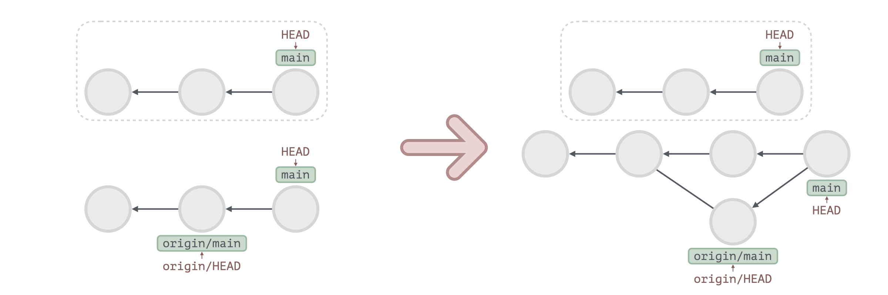

## Push

Git Push 上传本地修改到远程仓库，例如：

1. `git push origin feat`: 将 feat 分支上的修改推送到远程 origin feat 分支
2. `git push -u origin feat`: 将 feat 分支上的修改推送到远程 origin feat 分支，并将 feat 和 origin feat 进行关联
3. `git push`: 将当前分支的修改推送到远程同名分支（需要分支已关联）
4. `git push -d origin feat`: 删除远程 origin feat 分支

### 推送本地修改

```
5637202 (HEAD -> feat) commit 3
5650cb4 (origin/feat) commit 2
8c7a5ee commit 1
```

假设有以上提交历史，在本地执行 `git push` 后，Git 会做以下事情：

1. 将修改文件的对象推送到远程的 objects 文件
2. 更新远程 refs/heads/feat 分支指针，指向最新 commit

推送成功后，历史记录如下：

```
5637202 (HEAD -> hello, origin/hello) commit 3
5650cb4 commit 2
8c7a5ee commit 1
```

> [!CAUTION]
> 使用 `git push` 上传的文件的内容有大小限制，默认为 1MB，如果超过了 1MB 则需要
> 使用 `git config http.postBuffer` 配置缓冲区大小

### 删除远程分支

在本地执行 `git push -d origin feat` 后，Git 会做以下事情：

1. 删除远程 .git/refs/heads/feat 文件
2. 删除本地 .git/refs/remotes/origin/feat 文件

## Revert

Git Revert 用于抵消某次提交，例如：

1. `git revert A`: 抵消 commit A
2. `git revert A B`: 抵消 commit A B
3. `git revert A..C`: 抵消 commit B C

### 抵消单个提交

```
A <- B <- C
```

假设有以上提交历史，此时执行 `git revert B` 后，Git 会做以下事情：

1.  创建一个 commit B'，其内容与 commit B 相反

操作完成后，历史记录如下：

```
A <- B <- C <- B'
```

### 抵消多个提交

```
A <- B <- C <- D
```

假设有以上提交历史，此时执行 `git revert B..D` 后，Git 会做以下事情：

1.  创建 commit D', C'，其内容分别与 commit D, C 相反

操作完成后，历史记录如下：

```
A <- B <- C <- D <- D' <- C'
```

> [!NOTE]
> 注意 `git revert` 会先抵消最新的提交 D，再抵消提交 C

## Reset

Git Reset 用于还原 HEAD 到指定提交。例如：

1. `git reset --soft A`: 重置 HEAD 指针到 A
2. `git reset --mixed A`: 重置 HEAD 指针到 A，并更新 Index
3. `git reset --hard A`: 重置 HEAD 指针到 A，并更新 Index 和 Working Tree

### 重置指针

```
947a868 (HEAD -> main) commit 3
04022cf commit 2
8de34b2 commit 1
```

假设有以上提交历史，此时执行 `git reset --soft 04022cf` 后，Git 会做以下事情：

1. 更新 main 指针，指向 commit 2
   ```diff
   - .git/refs/heads/main
   + .git/refs/heads/main
   ```
   ```sh
   $ cat .git/refs/heads/main
   04022cf
   ```

操作完成后，历史记录如下：

```
04022cf (HEAD -> feat) commit 2
8de34b2 commit 1
```

操作完成后，文件状态如下：

```
工作区：
暂存区：apple.txt
```

> [!NOTE]
> 由于 `reset --soft` 仅仅移动了指针，因此还原 Reset 之前的状态很容易，
> 只需要把指针移动回去：`git reset --soft 947a868`

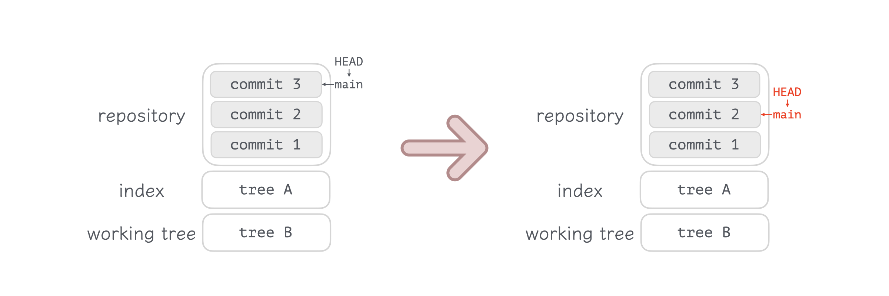

### 重置指针，暂存区

```
947a868 (HEAD -> main) commit 3
04022cf commit 2
8de34b2 commit 1
```

假设有以上提交历史，此时执行 `git reset --mixed 04022cf` 后，Git 会做以下事情：

1. 更新 main 指针，指向 commit 2
   ```diff
   - .git/refs/heads/main
   + .git/refs/heads/main
   ```
   ```sh
   $ cat .git/refs/heads/main
   04022cf
   ```
2. 更新 Index，内容为 commit 2 tree 对象的内容

```diff
- .git/index
+ .git/index
```

```sh
$ git ls-files -s # Index content
dbee026 apple.txt

$ git cat-file -p 04022cf # commit 2 content
tree 9fb894a
$ git cat-file -p 9fb894a # commit 2 tree content
dbee026 apple.txt
```

操作完成后，历史记录如下：

```
04022cf (HEAD -> feat) commit 2
8de34b2 commit 1
```

操作完成后，文件状态如下：

```
工作区：apple.txt
暂存区：
```

> [!NOTE]
> 由于 `reset --mixed` 仅仅移动了指针，并修改了 Index，因此还原 Reset 之前的状态很容易，
> 只需要把指针移动回去，并把 Index 改回去：`git reset --mixed 947a868`

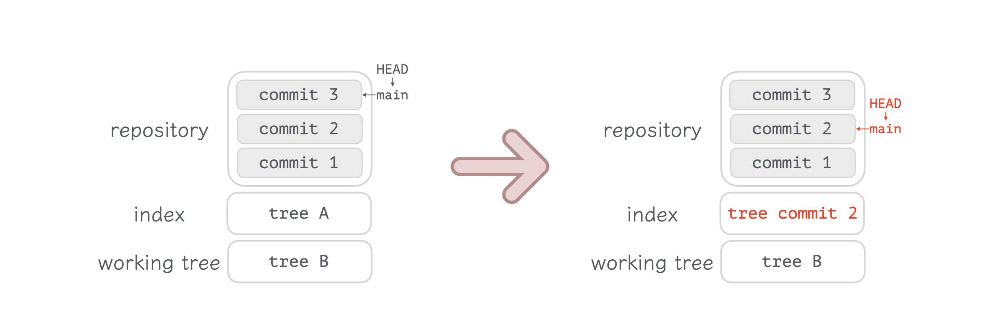

### 重置指针，暂存区，工作区

```
947a868 (HEAD -> main) commit 3
04022cf commit 2
8de34b2 commit 1
```

假设有以上提交历史，此时执行 `git reset --hard 04022cf` 后，Git 会做以下事情：

1. 更新 main 指针，指向 commit 2
   ```diff
   - .git/refs/heads/main
   + .git/refs/heads/main
   ```
   ```sh
   $ cat .git/refs/heads/main
   04022cf
   ```
2. 更新 Index，内容为 commit 2 tree 对象的内容

```diff
- .git/index
+ .git/index
```

```sh
$ git ls-files -s # Index content
dbee026 apple.txt

$ git cat-file -p 04022cf # commit 2 content
tree 9fb894a
$ git cat-file -p 9fb894a # commit 2 tree content
dbee026 apple.txt
```

3. 更新 Working Tree，内容与 Index 相同

操作完成后，历史记录如下：

```
04022cf (HEAD -> feat) commit 2
8de34b2 commit 1
```

操作完成后，文件状态如下：

```
工作区：
暂存区：
```

> [!NOTE]
> 由于 `reset --hard` 不仅修改了指针和 Index，还修改了 Working Tree，
> 因此还原 Reset 之前的状态比较困难，使用 `git reset --hard 947a868`
> 仅会还原指针和 Index。如果 Working Tree 的修改已经暂存，那么暂存的文件
> 可以去垃圾对象里翻找，如果 Working Tree 的修改没有暂存，那么 Git 将会丢失
> 这部分内容，但 IDE 的缓存文件里有可能可以找到

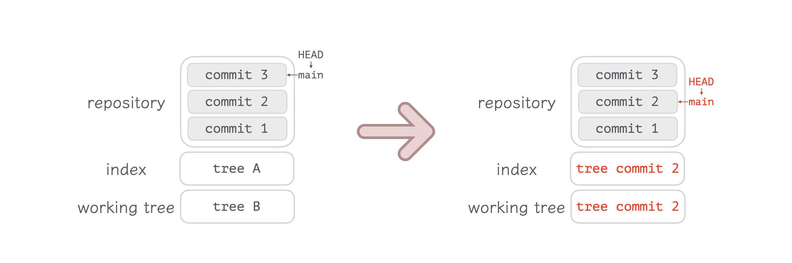

## Stash

## Restore

## Log

## Reflog
