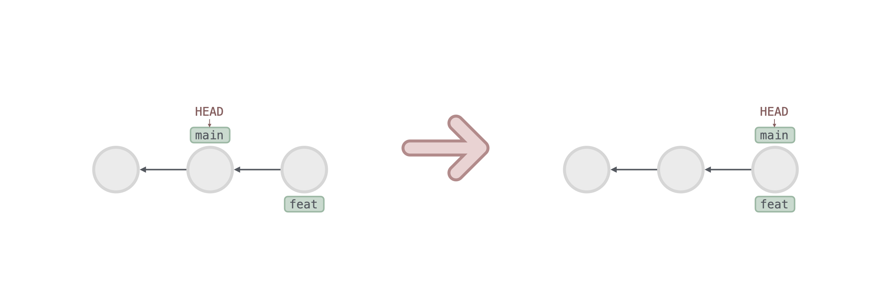
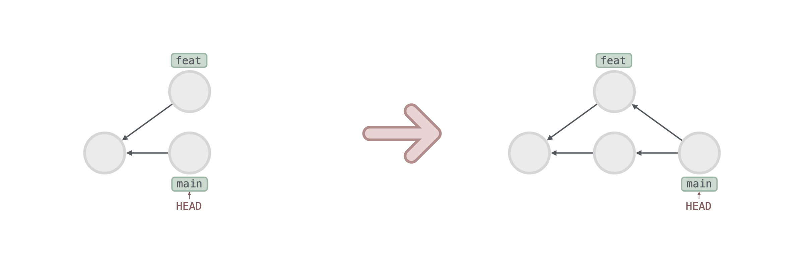

# Basic

## Init

Git Init 会初始化一个代码仓库，例如：

1. `git init`: 在当前目录下初始化一个代码仓库

### 新建仓库

```sh
fruits
```

假设有以上目录结构，在 `fruits` 路径下执行 `git init` 后，Git 会做以下事情：

1. 创建一个 .git 文件
   ```diff
   fruits
   + └── .git
   +   ├── config
   +   ├── description
   +   ├── HEAD
   +   ├── index
   +   ├── hooks
   +   │   └── samples
   +   ├── info
   +   │   └── exclude
   +   ├── objects
   +   │   ├── info
   +   │   └── pack
   +   └── refs
   +     ├── heads
   +     └── tags
   ```

## Add

Git Add 使用[文件通配符]()，将 Working Tree 的文件添加到 Index，例如：

1. `git add hello.txt`: 添加 hello.txt
2. `git add fruits`: 添加 fruits 目录下所有文件
3. `git add .`: 添加所有文件
4. `git add *.js`: 添加所有 js 文件

### 添加单个文件

```txt
// hello.txt
hello
```

假设有以上文件，执行 `git add hello.txt` 后，Git 会做以下事情：

1. 在 objects 目录下生成一个 blob 对象，其内容为 'hello'，文件名为 'hello' 的哈希值

   ```diff
   + .git/objects/ce01362
   ```

   ```sh
   $ git cat-file -t ce01362 # type
   blob

   $ git cat-file -p ce01362 # value
   hello
   ```

2. 在 index 中添加一条记录，记录文件路径和哈希值

   ```diff
   - .git/index
   + .git/index
   ```

   ```sh
   $ git ls-files -s # index
   ce01362 hello.txt
   ```

> [!NOTE]
> 当两个文件的内容相同时，它们的哈希值也相同，因此只会生成一个 blob 对象


### 添加文件夹中的文件

```txt
// greets/hello.txt
hello
```

若添加的是文件夹中的文件，Git 处理也几乎一样：

1. 在 objects 目录下生成一个 blob 对象

   ```diff
   + .git/objects/ce01362
   ```

   ```sh
   $ git cat-file -t ce01362 # type
   blob

   $ git cat-file -p ce01362 # value
   hello
   ```

2. 在 index 中添加一条记录

   ```diff
   - .git/index
   + .git/index
   ```

   ```sh
   $ git ls-files -s # index
   ce01362 greets/hello.txt # 这里不一样
   ```

## Commit

Git Commit 会将 Index 中的内容提交到 Repository，例如：

1. `git commit`: 提交 Index 中的内容，并打开 [Vim](../vim-cheet-sheet.md) 输入 commit message
2. `git commit -m 'update'`: 提交 Index 中的内容，并使用 'update' 作为 commit message
3. `git commit -a`: 等价于 `git add .` 加 `git commit`
4. `git commit -am 'update'`: 等价于 `git add .` 加 `git commit -m 'update'`

### 提交单个文件

```txt
4c479de apple.txt
```

假设 index 文件中有以上内容，执行 `git commit -m 'update'` 后，Git 会做以下事情：

1. 在 objects 目录下生成一个 tree 对象，该对象记录了根目录下文件的路径，以及对应的哈希值

   ```diff
   + .git/objects/1742682
   ```

   ```sh
   $ git cat-file -t 1742682 # type
   tree

   $ git cat-file -p 1742682 # value
   blob 4c479de apple.txt
   ```

2. 在 objects 目录下生成一个 commit 对象，记录了本次 commit 根目录的 tree，和 commit message 相关内容

   ```diff
   + .git/objects/6cc8ff6
   ```

   ```sh
   $ git cat-file -t 6cc8ff6 # type
   commit

   $ git cat-file -p 6cc8ff6 # value
   tree 1742682
   author wdyjwdy <email.com>
   committer wdyjwdy <email.com>

   update
   ```

3. 将当前分支指向生成的 commit 对象（当前分支即 HEAD 指向的分支）

   ```diff
   - .git/refs/heads/main
   + .git/refs/heads/main
   ```

   ```sh
   $ cat refs/heads/main # value
   6cc8ff6
   ```


### 提交文件夹中的文件

```txt
4c479de fruits/apple.txt
```

若 Index 中存在文件夹，如上，则 Git 会用 tree in tree 的方式来储存文件路径：

1. 在 objects 目录下生成第一个 tree 对象，该对象记录了 fruits 目录下文件的路径，以及对应的哈希值

   ```diff
   + .git/objects/1742682
   ```

   ```sh
   $ git cat-file -t 1742682 # type
   tree

   $ git cat-file -p 1742682 # value
   blob 4c479de apple.txt
   ```

2. 在 objects 目录下生成第二个 tree 对象，该对象记录了根目录下文件的路径，以及对应的哈希值

   ```diff
   + .git/objects/5635283
   ```

   ```sh
   $ git cat-file -t 5635283 # type
   tree

   $ git cat-file -p 5635283 # value
   tree 1742682 fruits # 指向第一步的 tree 对象
   ```

3. 在 objects 目录下生成一个 commit 对象，记录了本次 commit 根目录的 tree，和 commit message 相关内容

   ```diff
   + .git/objects/c2594b5
   ```

   ```sh
   $ git cat-file -t c2594b5 # type
   commit

   $ git cat-file -p c2594b5 # value
   tree 5635283
   author wdyjwdy <email.com>
   committer wdyjwdy <email.com>

   update
   ```

4. 更新分支指向

## Branch

Git Branch 会创建一个新的分支，例如：

1. `git branch`: 显示本地分支
2. `git branch -a`: 显示本地和远程分支
3. `git branch feat`: 创建一个名为 feat 的分支
4. `git branch -d feat`: 删除 feat 分支
5. `git branch -D feat`: 强制删除 feat 分支

### 新建分支

```sh
$ git log --oneline # history
846aac5 (HEAD -> main) commit 3
d58f2f5 commit 2
43bed3d commit 1
```

假设有以上提交历史，在 main 分支上执行 `git branch feat` 后，Git 会做以下事情：

1. 在 refs/heads 目录下创建一个名为 feat 的文件，内容为当前分支最新 commit 的哈希值

   ```diff
   + .git/refs/heads/feat
   ```

   ```sh
   $ cat refs/heads/feat # value
   846aac5
   ```

新建分支后，历史记录如下：

```sh
$ git log --oneline # history
846aac5 (HEAD -> main, feat) commit 3
d58f2f5 commit 2
43bed3d commit 1
```


### 如何找到当前分支的最新提交

1. 查看 HEAD 文件，获取当前分支的引用

   ```sh
   $ cat HEAD # value
   ref: refs/heads/main
   ```

2. 查看当前分支的最新提交

   ```sh
   $ cat refs/heads/main # value
   846aac5
   ```

### 删除分支

```sh
$ git log --oneline # history
846aac5 (HEAD -> main, feat) commit 3
d58f2f5 commit 2
43bed3d commit 1
```

假设有以上提交历史，执行 `git branch -d feat` 后，Git 会做以下事情：

1. 删除 refs/heads 目录下的 feat 文件

   ```diff
   - .git/refs/heads/feat
   ```

删除分支后，历史记录如下：

```sh
$ git log --oneline # history
846aac5 (HEAD -> main) commit 3
d58f2f5 commit 2
43bed3d commit 1
```

> [!NOTE]
> 删除分支后，分支上的 commit 对象并不会被删除，这些对象会变成垃圾对象

## Switch

Git Switch 会切换分支，例如：

1. `git switch feat`: 切换到 feat 分支
2. `git switch -c feat`: 创建并切换到 feat 分支
3. `git switch --detach 6cc8ff6`: 切换到 commit 6cc8ff6

### 切换分支

```sh
$ git log --oneline # history
846aac5 (HEAD -> main, feat) commit 3
d58f2f5 commit 2
43bed3d commit 1
```

假设有以上提交历史，执行 `git switch feat` 后，Git 会做以下事情：

1. 更新 HEAD 文件，将其指向 feat 分支

   ```diff
   - .git/HEAD
   + .git/HEAD
   ```

   ```sh
   $ cat HEAD # value
   ref: refs/heads/feat
   ```

切换分支后，历史记录如下：

```sh
$ git log --oneline # history
846aac5 (HEAD -> feat, main) commit 3
d58f2f5 commit 2
43bed3d commit 1
```


### 切换到提交

```sh
$ git log --oneline # history
846aac5 (HEAD -> main) commit 3
d58f2f5 commit 2
43bed3d commit 1
```

假设有以上提交历史，执行 `git switch --detach 43bed3d` 后，Git 会做以下事情：

1. 更新 HEAD 文件，将其指向 43bed3d (commit 1)

   ```diff
   - .git/HEAD
   + .git/HEAD
   ```

   ```sh
   $ cat HEAD # value
   43bed3d
   ```

切换到提交后，历史记录如下：

```sh
$ git log --oneline --all # history
846aac5 (main) commit 3
d58f2f5 commit 2
43bed3d (HEAD) commit 1
```


> [!NOTE]
> 如果想基于该提交开始工作，可以执行 `git switch -c <name>` 创建一个新分支，并在新分支上工作

## Merge

Git Merge 会合并分支，例如：

1. `git merge feat`: 将 feat 分支合并到当前分支

### 快速合并

```sh
$ git log --oneline --all --graph # history
* b0cd9f5 (feat) commit 3
* e1e6af3 (HEAD -> main) commit 2
* 1b157d3 commit 1
```

假设有以上提交历史，feat 为 main 的直接后继节点，此时我们在 main 分支执行 `git merge feat` 后，Git 会做以下事情：

1. 更新 ORIG_HEAD 指针，指向 main 分支的最新提交，即 commit 2

   ```diff
   - .git/ORIG_HEAD
   + .git/ORIG_HEAD
   ```

   ```sh
   $ cat ORIG_HEAD # value
   e1e6af3
   ```

2. 更新 main 分支指针，指向 feat 分支的最新提交，即 commit 3

   ```diff
   - .git/refs/heads/main
   + .git/refs/heads/main
   ```

   ```sh
   $ cat refs/heads/main # value
   b0cd9f5
   ```

合并完成后，历史记录如下：

```sh
$ git log --oneline --all --graph # history
* b0cd9f5 (HEAD -> main, feat) commit 3
* e1e6af3 commit 2
* 1b157d3 commit 1
```



### 三路合并

```sh
$ git log --oneline --all --graph # history
* a9532ef (HEAD -> main) commit 3
| * 88d8b74 (feat) commit 2
|/
* 34b711b commit 1
```

假设有以上提交历史，feat 不是 main 的直接后继节点，此时我们在 main 分支执行 `git merge feat` 后，Git 会做以下事情：

1. 更新 ORIG_HEAD 指针，指向 main 分支的最新提交，即 commit 3

   ```diff
   - .git/ORIG_HEAD
   + .git/ORIG_HEAD
   ```

   ```sh
   $ cat ORIG_HEAD # value
   a9532ef
   ```

2. 创建一个新的 merge commit 对象，记录了 feat 中的修改（注意 merge commit 对象有两个 parent）

   ```diff
   # tree
   + .git/objects/03b2125
   # commit
   + .git/objects/cbd588d
   ```

   ```sh
   $ git cat-file -p cbd588d # value
   tree 03b2125
   parent a9532ef # commit 3
   parent 88d8b74 # commit 2
   author wdyjwdy <email.com>
   committer wdyjwdy <email.com>

   Merge branch 'feat'
   ```

3. 更新 main 分支指针，指向新的 merge commit 对象

   ```diff
   - .git/refs/heads/main
   + .git/refs/heads/main
   ```

   ```sh
   $ cat refs/heads/main # value
   cbd588d
   ```

合并完成后，历史记录如下：

```sh
$ git log --oneline --all --graph # history
*   cbd588d (HEAD -> main) Merge branch 'feat'
|\
| * 88d8b74 (feat) commit 2
* | a9532ef commit 3
|/
* 34b711b commit 1
```



### 带冲突的三路合并

```sh
$ git log --oneline --all --graph # history
* fb1c925 (feat) commit 3
| * bcf8030 (HEAD -> main) commit 2
|/
* ccf620f commit 1
```

假设有以上提交历史，如果 feat 和 main 分支在同一行上都有修改，此时执行 `git merge feat` 会产生冲突，Git 会做以下事情：

1. 更新 ORIG_HEAD 指针
2. 新增或修改一些文件，用于解决冲突

   ```diff
   # 记录冲突文件的三个版本
   - .git/index
   + .git/index
   ```

   ```sh
   $ git ls-files -s # value
   4c479de	apple.txt # commit 1 (root)
   4a77268	apple.txt # commit 2 (main)
   29b651e	apple.txt # commit 3 (feat)
   ```

   ```diff
   # 用户解决冲突的文件
   # tree
   + .git/objects/b3535c9
   # blob
   + .git/objects/675e90a
   ```

   ```sh
   $ git cat-file -p 675e90 # value
   apple
   <<<<<<< HEAD
   banana
   =======
   cherry
   >>>>>>> feat
   ```

   ```diff
   # 记录冲突的状态
   .git
   + ├── AUTO_MERGE # 指向解决冲突的文件
   + ├── MERGE_HEAD # 指向 feat 分支的最新提交
   + ├── MERGE_MODE # 合并模式
   + └── MERGE_MSG  # merge commit message
   ```

3. 用户解决冲突，即暂存了所有解决冲突的文件后，执行 `git commit` 命令，手动提交 merge commit（提交后，Git 会删除之前用于解决冲突的临时文件）
4. 更新 main 分支指针

合并完成后，历史记录如下：

```sh
$ git log --oneline --all --graph # history
*   ab3525e (HEAD -> main) Merge branch 'feat'
|\
| * fb1c925 (feat) commit 3
* | bcf8030 commit 2
|/
* ccf620f commit 1
```

## Rebase

Rebase 会将一系列 commit 重新应用到指定分支，例如：

1. `git rebase main`: 将当前分支的 commit 重新提交到 main 分支上

### 分支变基

```sh
$ git log --oneline --all --graph # history
* fda4ab8 (feat) commit 3
| * 3007e64 (HEAD -> main) commit 2
|/
* 2239c5b commit 1
```

假设有以上提交历史，此时我们在 feat 分支执行 `git rebase main` 后，Git 会做以下事情：

1. 将 feat 分支中 root 节点之后的 commit（即 commit 3），重新提交到 main 分支上

   ```diff
   # tree
   + .git/objects/830241f
   # commit
   + .git/objects/37ffdf1
   ```

2. 更新 feat 分支指针，指向新的 commit

   ```diff
   - .git/refs/heads/feat
   + .git/refs/heads/feat
   ```

   ```sh
   $ cat refs/heads/feat # value
   37ffdf1
   ```

合并完成后，历史记录如下：

```sh
$ git log --oneline --all --graph # history
* 37ffdf1 (feat) commit 3
* 3007e64 (HEAD -> main) commit 2
* 2239c5b commit 1
```

> [!CAUTION]
> 注意 rebase 后的 commit 哈希值会改变


### 带冲突的分支变基

和[带冲突的三路合并](#带冲突的三路合并)几乎一样，只有以下区别：

1. 当有多个 commit 需要处理时，rebase 会逐个处理 commit 的冲突，而 merge 会一次性处理所有 commit 的冲突
2. rebase 会新增多个 commit，而 merge 只会新增一个 commit
3. rebase 会移动 feat 分支指针，而 merge 会移动 main 分支指针

## Tag

Git Tag 会为指定提交创建一个标签，例如：

1. `git tag v1`: 为当前提交，创建一个名为 'v1' 的标签
2. `git tag -a v1 -m 'version 1'`: 为当前提交，创建一个名为 'v1' 的标签，标签信息为 'version 1'
3. `git tag -a v1 2239c5b`: 为指定提交，创建一个名为 'v1' 的标签
4. `git tag`: 列出所有标签
5. `git tag -d v1`: 删除名为 'v1' 标签

### 简单标签

```sh
$ git log --oneline # history
a0f247e (HEAD -> main) commit 3
57ca93f commit 2
e7f88c9 commit 1
```

假设有以上提交历史，此时执行 `git tag v1` 后，Git 会做以下事情：

1. 在 refs/tags 目录下创建一个名为 v1 的文件，内容为当前 commit 的哈希值

   ```diff
   + .git/refs/tags/v1
   ```

   ```sh
   $ cat refs/tags/v1 # value
   a0f247e
   ```

创建完成后，历史记录如下：

```sh
$ git log --oneline # history
a0f247e (HEAD -> main, tag: v1) commit 3
57ca93f commit 2
e7f88c9 commit 1
```

### 内容标签

```sh
$ git log --oneline # history
a0f247e (HEAD -> main) commit 3
57ca93f commit 2
e7f88c9 commit 1
```

假设有以上提交历史，此时执行 `git tag -a v1 -m 'version 1'` 后，Git 会做以下事情：

1. 在 refs/tags 目录下创建一个名为 v1 的文件，内容为当前 commit 的哈希值

   ```diff
   + .git/refs/tags/v1
   ```

   ```sh
   $ cat refs/tags/v1 # value
   a0f247e
   ```

2. 在 objects 目录下创建一个 tag 对象，内容为 tag message 信息

   ```diff
   + .git/objects/adf306e
   ```

   ```sh
   $ git cat-file -t adf306e # type
   tag

   $ git cat-file -p adf306e # value
   object a0f247e
   type commit
   tag v1
   tagger wdyjwdy <email.com>

   version 1
   ```

创建完成后，历史记录如下：

```sh
$ git log --oneline # history
a0f247e (HEAD -> main, tag: v1) commit 3
57ca93f commit 2
e7f88c9 commit 1
```

> [!NOTE]
> 删除内容标签后，tag 对象不会被删除，成为了垃圾对象


